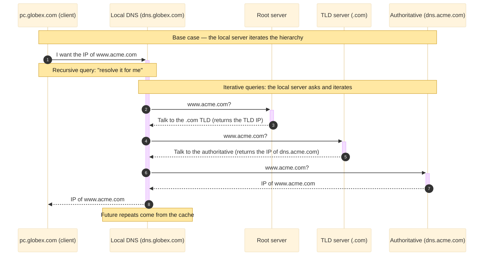
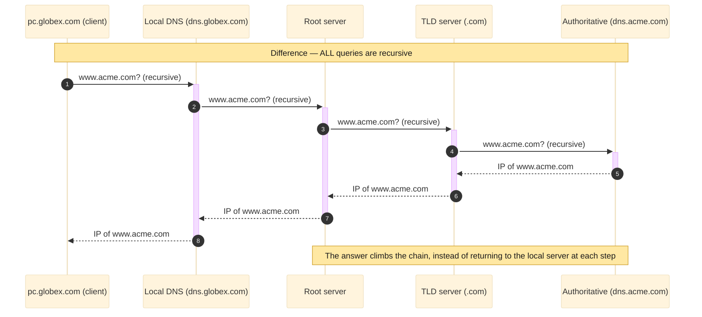
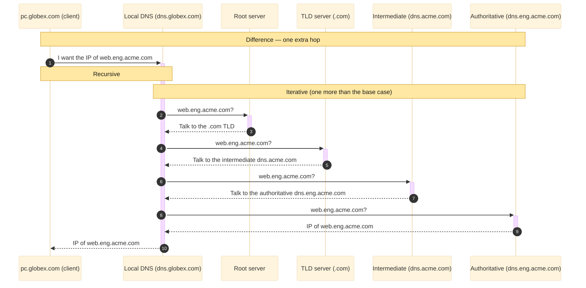
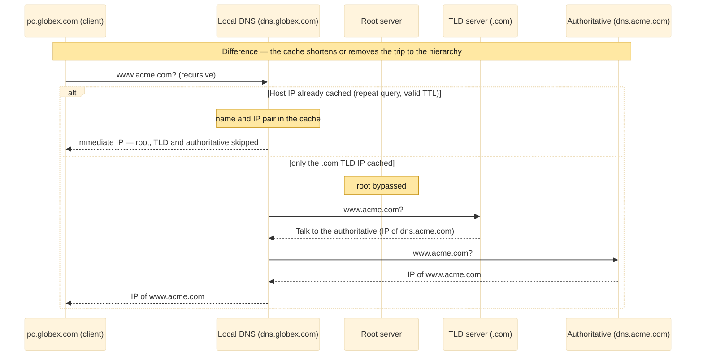
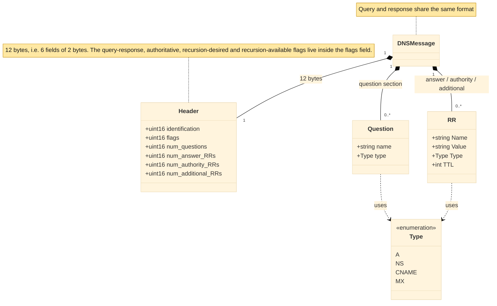
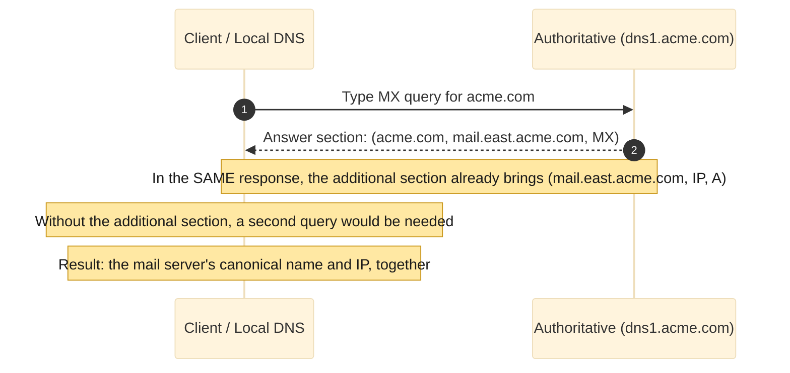
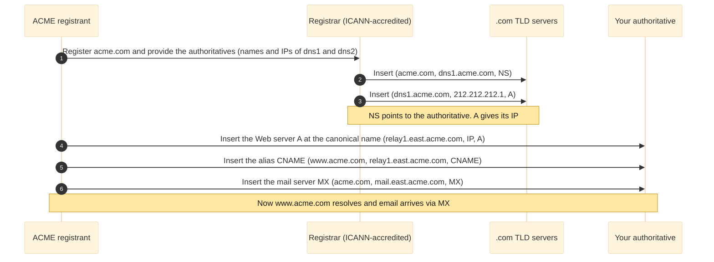

import { Definition, Note, Warning, Figure, Sidenote } from '../../../components/mdx';

Each access to a website is preceded by a silent question posed by the host: the IP address corresponding to a given name. The answer comes
from **DNS** (the Domain Name System), the Internet's directory service. This article examines that black box. The theory follows the
fundamentals of Kurose and Ross [@KuroseRoss2021], and each concept is paired with the command that renders it observable, with the **real**
output captured on a Windows machine using `nslookup`, PowerShell and Wireshark. The outputs were collected on June 6, 2026, and are
reproduced exactly as they left the terminal.

<nav class="paper-toc" aria-label="Contents">

**Contents**

- [The problem: two identifiers](#the-problem-two-identifiers)
- [The DNS client lives on your machine](#the-dns-client-lives-on-your-machine)
- [The four DNS services](#the-four-dns-services)
- [Why DNS is not centralized](#why-dns-is-not-centralized)
- [The server hierarchy](#the-server-hierarchy)
- [Resolution step by step](#resolution-step-by-step)
- [Cache and TTL](#cache-and-ttl)
- [Resource records](#resource-records)
- [The DNS message](#the-dns-message)
- [How records enter the database](#how-records-enter-the-database)
- [DNS security](#dns-security)
- [Next steps](#next-steps)

</nav>

## The problem: two identifiers

People are identified in many ways — by name, by an ID number, by a tax ID. In each context, one identifier serves better than another.
Automated systems prefer fixed-length numbers, while people prefer names, which are easier to remember. The same holds for hosts on the
Internet, and DNS exists to reconcile the two identifiers every host carries.

The first is the **hostname**, such as `www.acme.com`. It is made for humans and is therefore easy to remember, but it has two weaknesses
for the network. It conveys almost nothing about _where_ the host is, and, being alphanumeric and variable in length, it is hard for a
router to process. The second is the **IP address** (Internet Protocol), four bytes such as `121.7.106.83`, each byte a decimal from 0
to 255. It has a rigid hierarchical structure and a fixed length, exactly what a router prefers. It is hierarchical in the sense that, read
left to right, it reveals increasingly specific information about where the host is, like a postal address read from country down to street.

Reconciling "a name that is easy to remember" with "an address the network knows how to route" requires a directory service that translates
a name into an IP. That is the main task of DNS, which is in fact two things at once: a **distributed database**, implemented across a
hierarchy of servers spread around the world, and an **application-layer protocol** that lets a host query that database. The protocol runs
over **UDP** (the User Datagram Protocol), on port **53**, and is specified in RFCs 1034 and 1035 [@RFC1034; @RFC1035]. In practice, the
servers usually run the **BIND** (Berkeley Internet Name Domain) software.

All of this can be observed at once with a single command. `nslookup` takes a name, queries the DNS server, and displays the answer.

```bat
nslookup www.github.com.
```

```text
Server:  UnKnown
Address:  192.168.40.1

Non-authoritative answer:
Name:    github.com
Address:  140.82.113.4
Aliases:  www.github.com
```

The top block, with `Server:` and `Address:`, identifies the **resolver** that answered, usually the network's router or the provider's DNS.
The name showing up as `UnKnown` is not an error; it simply means that server has no reverse name configured. The
`Non-authoritative answer:` line reveals that the IP came from the resolver's **cache**, not from the server that owns the domain — that is
the common case, and the first manifestation of the cache examined in detail later. Since `www.github.com` is an alias, Windows shows the
canonical name in `Name:` and the queried name in `Aliases:`.

<Note>
  The trailing dot in `www.github.com.` is deliberate. Without it, Windows appends the network's search suffix (here, `lan`) and queries
  `www.github.com.lan` first, polluting the result and, later on, the Wireshark capture. The trailing dot signals that the name is complete
  and that nothing should be appended.
</Note>

## The DNS client lives on your machine

DNS almost never appears on its own. **HTTP** (the Hypertext Transfer Protocol), **SMTP** (the Simple Mail Transfer Protocol) and others
invoke it under the hood to translate the name the user typed. Consider the access to `www.acme.com/index.html`:

1. The user's own machine runs the **client side** of DNS. It is not a separate remote server; it resides on the host.
2. The browser extracts the hostname `www.acme.com` from the URL and hands it to the DNS client.
3. The DNS client sends a query with that name to a DNS server.
4. The client receives back the IP corresponding to the name.
5. Only then, holding the IP, does the browser open the **TCP** (Transmission Control Protocol) connection to the HTTP server on port 80.

Because this translation happens **before** any application data flows, DNS adds delay, sometimes substantial. The cache mitigates this: the
IP being sought is almost always already stored on a nearby server, which reduces both the average delay and the DNS traffic on the network.

The server that answered the previous query can be identified with `ipconfig /all`. (The output is trimmed to the relevant lines, and the
physical address and machine identifiers are hidden.)

```bat
ipconfig /all
```

```text
Ethernet adapter Ethernet:

   Connection-specific DNS Suffix  . : lan
   DHCP Enabled. . . . . . . . . . . : Yes
   IPv4 Address. . . . . . . . . . . : 192.168.40.166(Preferred)
   Default Gateway . . . . . . . . . : 192.168.40.1
   DHCP Server . . . . . . . . . . . : 192.168.40.1
   DNS Servers . . . . . . . . . . . : 192.168.40.1
```

The `DNS Servers` line carries the resolver configured on the adapter, and it is the same `192.168.40.1` that appeared as `Server:` in the
previous query. That address arrived automatically via **DHCP** (the Dynamic Host Configuration Protocol), which distributes network
settings. It is the local DNS server, which acts as a proxy for the host's queries and which is examined more closely in the section on the
hierarchy.

That other protocols invoke DNS under the hood is confirmed by a `ping`. It resolves the name **before** sending any packet.

```bat
ping -n 4 www.github.com.
```

```text
Pinging github.com [140.82.113.4] with 32 bytes of data:
Reply from 140.82.113.4: bytes=32 time=50ms TTL=48
Reply from 140.82.113.4: bytes=32 time=38ms TTL=48
Reply from 140.82.113.4: bytes=32 time=36ms TTL=48
Reply from 140.82.113.4: bytes=32 time=37ms TTL=48

Ping statistics for 140.82.113.4:
    Packets: Sent = 4, Received = 4, Lost = 0 (0% loss),
Approximate round trip times in milli-seconds:
    Minimum = 36ms, Maximum = 50ms, Average = 40ms
```

The first line is the proof: `Pinging github.com [140.82.113.4]`. The IP in brackets can only be there because the name **was already
resolved by DNS** before the first packet. Note as well that, although `www.github.com` was typed, `ping` shows the canonical name
`github.com`, the same alias → canonical chain the first query revealed.

## The four DNS services

Beyond name → IP translation, DNS offers three other services. Using the fictional company **Acme** (`acme.com`):

1. **Name → IP translation**, the main service already seen.
2. **Host aliasing.** A real server usually has a complicated canonical name, such as `relay1.east.acme.com`. For users, simpler aliases are
   defined, such as `www.acme.com`. The simpler name typed by the user is, underneath, a pointer to the real canonical name.
3. **Mail-server aliasing.** The same idea applied to email. The address should be simple (`bob@acme.com`) even if the real mail server has
   a complicated name. The **MX** (Mail Exchange) record makes this possible, and it lets the Web server and the mail server share the same
   alias `acme.com`.
4. **Load distribution.** Busy sites are replicated across several servers, each with an IP. A single alias is associated with a **set** of
   addresses, and on each query the server returns the whole set but rotates the order (round-robin). Since the client usually uses the
   first address in the list, requests spread across the replicas.

Host aliasing becomes clear by querying the CNAME record directly and, in a richer case, observing the whole chain a CDN builds:

```bat
nslookup -type=CNAME www.github.com.
```

```text
Server:  UnKnown
Address:  192.168.40.1

www.github.com  canonical name = github.com
```

The phrase `canonical name =` is literally the canonical name of the concept. The richer case follows, with PowerShell's `Resolve-DnsName`:

```powershell
Resolve-DnsName -Name www.amazon.com -Type A
```

```text
Name                           Type   TTL   Section    NameHost
----                           ----   ---   -------    --------
www.amazon.com                 CNAME  54    Answer     tp.47cf2c8c9-frontier.amazon.com
tp.47cf2c8c9-frontier.amazon.c CNAME  54    Answer     cf.47cf2c8c9-frontier.amazon.com
om

Name       : cf.47cf2c8c9-frontier.amazon.com
QueryType  : A
TTL        : 58
Section    : Answer
IP4Address : 13.225.51.229
```

`www.amazon.com` is merely the alias at the tip of a chain: it points to `tp.47cf2c8c9-frontier.amazon.com`, which points to
`cf.47cf2c8c9-frontier.amazon.com`, which finally resolves to the IP `13.225.51.229` on CloudFront, Amazon's own CDN. PowerShell shows the
two **CNAMEs** in a table (all have the `NameHost` column) and the **A record** at the end in a separate block, because it carries
`IP4Address` instead of `NameHost`. The IP and the TTLs change on every query; what matters is the alias → canonical chain reaching the
address.

Mail-server aliasing appears in the MX query:

```bat
nslookup -type=MX gmail.com.
```

```text
Server:  UnKnown
Address:  192.168.40.1

Non-authoritative answer:
gmail.com       MX preference = 10, mail exchanger = alt1.gmail-smtp-in.l.google.com
gmail.com       MX preference = 40, mail exchanger = alt4.gmail-smtp-in.l.google.com
gmail.com       MX preference = 30, mail exchanger = alt3.gmail-smtp-in.l.google.com
gmail.com       MX preference = 20, mail exchanger = alt2.gmail-smtp-in.l.google.com
gmail.com       MX preference = 5, mail exchanger = gmail-smtp-in.l.google.com
```

Each `mail exchanger` is the canonical name of a mail server, and `preference` is the priority — the lower, the more preferred. The
lowest-preference server here is `gmail-smtp-in.l.google.com`, with preference 5.

Load distribution becomes visible when a heavily replicated name is queried twice in a row:

```bat
nslookup yahoo.com.
```

```text
Non-authoritative answer:
Name:    yahoo.com
Addresses:  2001:4998:24:120d::1:1
          2001:4998:124:1507::f000
          2001:4998:44:3507::8001
          2001:4998:44:3507::8000
          2001:4998:124:1507::f001
          2001:4998:24:120d::1:0
          74.6.143.26
          74.6.143.25
          98.137.11.164
          98.137.11.163
          74.6.231.21
          74.6.231.20
```

Running the same command again, the order changes:

```text
Non-authoritative answer:
Name:    yahoo.com
Addresses:  2001:4998:24:120d::1:0
          2001:4998:124:1507::f001
          2001:4998:44:3507::8000
          2001:4998:44:3507::8001
          2001:4998:124:1507::f000
          2001:4998:24:120d::1:1
          74.6.231.20
          74.6.143.26
          74.6.143.25
          98.137.11.164
          98.137.11.163
          74.6.231.21
```

With more than one address, the label changes from `Address:` (singular) to `Addresses:` (plural). This is load distribution: a single name
associated with a set of servers, here replicated in IPv6 (the `2001:4998:...`, **AAAA** records) and IPv4 (the `74.6...` and `98.137...`,
**A** records). Between the two runs, the contents are the same but the order was rotated. Since the client almost always uses the first
address, different clients end up on different replicas and the load spreads.

<Note>
  DNS is an application-layer protocol for two reasons: it runs between end systems in the client-server paradigm and relies on an
  end-to-end transport protocol (UDP) to carry its messages. There is, however, a difference from the Web or email — no one invokes DNS
  directly. It is a core support function, triggered by other applications. This is a deliberate design decision: pushing a critical
  function to the edge of the network, on the hosts, keeps the core simple.
</Note>

## Why DNS is not centralized

The naive design would be a single DNS server with all the mappings, receiving every query in the world. It is simple, but unworkable, for
four reasons [@KuroseRoss2021]:

1. **Single point of failure.** If that server goes down, the entire Internet stops.
2. **Traffic volume.** A single server would have to handle every DNS query on the planet.
3. **A distant centralized database.** No server can be close to every client. A single server in New York would make queries from Australia
   cross the globe.
4. **Maintenance.** A database with records for every host would be gigantic and require constant updating.

Centralizing does not scale. That is why DNS is distributed by design.

## The server hierarchy

DNS uses a large number of hierarchically organized servers. No single server holds all the mappings — they are partitioned across three
classes, plus the local server, which sits outside the hierarchy.

- **Root servers.** There are over a thousand instances around the world, copies of 13 distinct root servers, coordinated by the **IANA**
  (Internet Assigned Numbers Authority). They provide the IPs of the TLD servers.
- **TLD servers** (Top-Level Domain). One cluster for each top-level domain: `com`, `org`, `net`, `edu`, and the country ones (`br`, `fr`,
  `jp`). Verisign maintains the `.com` ones, for example. They provide the IPs of the authoritative servers.
- **Authoritative servers.** Every organization with publicly accessible hosts publishes records mapping names to IPs, and the authoritative
  server holds those records. It can be self-run or hosted at a provider, usually with a primary and a secondary.

<Definition title="Local DNS server">
  The server each ISP (Internet Service Provider) offers and that the host receives via DHCP. It does not belong to the hierarchy: it sits
  "close" to the host and acts as a **proxy**, receiving the host's query and relaying it to the root, the TLD and the authoritative server.
</Definition>

## Resolution step by step

Consider `pc.globex.com` seeking the IP of `www.acme.com`. The query goes first to the local server `dns.globex.com`, which walks the
hierarchy on its behalf:

1. `pc.globex.com` → `dns.globex.com`: query with the name `www.acme.com`.
2. `dns.globex.com` → **root** server.
3. The root identifies the `.com` suffix and returns the IPs of the **TLD** servers for `.com`.
4. `dns.globex.com` → **TLD** server.
5. The TLD identifies `acme.com` and returns the IP of the **authoritative** server `dns.acme.com`.
6. `dns.globex.com` → `dns.acme.com`.
7. The authoritative server returns the IP of `www.acme.com`.
8. `dns.globex.com` → `pc.globex.com`: delivers the IP to the host.

That is four queries and four responses, **eight messages** to resolve a name with no cache.

<Figure caption="Figure 1 — Typical iterative resolution with no cache: only the first query is recursive, and the local server asks at each level (root, TLD, authoritative)." zoomable>



</Figure>

There are two kinds of query at play. In a **recursive** query, the host asks the server to obtain the mapping on its behalf and return the
final answer. In an **iterative** query, each server replies "I do not know, but ask that one over there", and the local server is the one
that iterates. In theory, any query could be of either kind. In practice, the pattern is fixed: host → local is recursive, and the rest is
iterative.

<Figure caption="Figure 2 — Fully recursive resolution: each server forwards the query to the next, and the answer climbs back up the chain. The local server does not iterate." zoomable>



</Figure>

In practice, the TLD server often does not directly know the authoritative server, only an **intermediate** server. For example, inside
Acme, `dns.acme.com` is intermediate and the engineering department has its own authoritative server `dns.eng.acme.com`. Resolving
`web.eng.acme.com` requires one extra hop, totaling **ten messages**.

<Figure caption="Figure 3 — Variant with an intermediate server: the TLD points to the intermediate, not the authoritative, producing ten messages." zoomable>



</Figure>

This path can be walked by hand. Rather than letting the local server iterate, each level is queried one at a time, always without recursion
(`-norecurse`) and requesting the name servers (`-type=NS`). The walk begins at a root server:

```bat
nslookup -norecurse -type=NS github.com. 198.41.0.4
```

```text
Server:  UnKnown
Address:  198.41.0.4

com     nameserver = a.gtld-servers.net
com     nameserver = b.gtld-servers.net
com     nameserver = l.gtld-servers.net
[... 13 .com servers in total ...]
a.gtld-servers.net      internet address = 192.5.6.30
l.gtld-servers.net      internet address = 192.41.162.30
[... A and AAAA glue records for each ...]
```

The root does not know the IP of `github.com`, so it returns a **referral** to the `.com` TLD servers. Note the two line forms:
`nameserver =` is an **NS** record (the next-level server), and `internet address =` is the **A** glue record with that server's IP. One of
the TLD IPs (`192.41.162.30`, from `l.gtld-servers.net`) is selected and queried:

```bat
nslookup -norecurse -type=NS github.com. 192.41.162.30
```

```text
Server:  UnKnown
Address:  192.41.162.30

github.com      nameserver = ns-520.awsdns-01.net
github.com      nameserver = ns-421.awsdns-52.com
[... 8 authoritative servers in total ...]
ns-421.awsdns-52.com    internet address = 205.251.193.165
```

The TLD also does not know the final IP, but returns another referral, now to the **authoritative** servers of `github.com`, already sending
the glue with one server's IP. That IP (`205.251.193.165`) is used in the last hop, now requesting the **A** record and turning on debugging
(`-debug`) to expose the flags:

```bat
nslookup -debug -norecurse -type=A github.com. 205.251.193.165
```

```text
Got answer:
    HEADER:
        opcode = QUERY, id = 2, rcode = NOERROR
        header flags:  response, auth. answer
        questions = 1,  answers = 1,  authority records = 8,  additional = 0
    QUESTIONS:
        github.com, type = A, class = IN
    ANSWERS:
    ->  github.com
        internet address = 140.82.114.3
        ttl = 60 (1 min)
    [... 8 AUTHORITY RECORDS (NS) ...]

Name:    github.com
Address:  140.82.114.3
```

The referral → referral → answer pattern is exactly the iterative resolution of the eight messages. Comparing the worlds: in the first two
hops there was no `auth. answer`, only `nameserver =`, because they were delegations. In the last hop the `auth. answer` flag appears and
the IP comes in the `ANSWERS` section. That authoritative IP, `140.82.114.3`, is even different from the `140.82.113.4` the local resolver
returned at the start — GitHub publishes several replicas, and which one is reached depends on which server answers and what is in cache.

<Warning>
  On Windows, before each useful answer, `nslookup` prints a block of noise: it tries to find the reverse name of the targeted server and
  fails, showing `in-addr.arpa ...`, `(root) ...` lines or an `rcode = REFUSED`. That top block and the `Server: UnKnown` may be ignored —
  the answer that matters comes **after** it. The excerpts above are already trimmed at that point.
</Warning>

## Cache and TTL

When a server receives an answer, it stores the name → IP pair in its local memory cache. On a subsequent query for the same name, it
returns the IP from the cache, even without authority over that name. Mappings are not permanent: each record has an expiry, the **TTL**
(Time To Live), often on the order of two days, after which the entry is discarded. Since local servers also cache the IPs of the TLD
servers, the root servers end up bypassed on practically every query.

<Figure caption="Figure 4 — Cache shortcuts: a repeated answer comes straight from the local server, skipping the hierarchy. With only the TLD cached, just the root is bypassed." zoomable>



</Figure>

To observe the TTL count down, a name with a long TTL is appropriate, such as the apex `globo.com`. The client cache is first cleared and
populated with a query (in PowerShell, as administrator):

```powershell
Clear-DnsClientCache
Resolve-DnsName globo.com
```

```text
Name                                           Type   TTL   Section    IPAddress
----                                           ----   ---   -------    ---------
globo.com                                      A      2813  Answer     186.192.83.12
```

The entry already present in the client cache is then read:

```powershell
Get-DnsClientCache -Name globo.com
```

```text
Entry           RecordName      Record Status   Section TimeTo Data   Data
                                Type                    Live   Length
-----           ----------      ------ ------    ------- ------ ------ ----
globo.com       globo.com       A      Success   Answer    2812      4 186.192.83.12
```

That table is the resource record in columns: `RecordName` is the name, `Data` is the value (the IP), `RecordType` is the type (`A`) and
`TimeToLive` is the TTL in seconds, the number that will fall. After twenty seconds without querying the name again — since any new query
refills the entry — it is read once more:

```powershell
Start-Sleep -Seconds 20
Get-DnsClientCache -Name globo.com
```

```text
globo.com       globo.com       A      Success   Answer    2792      4 186.192.83.12
```

The `TimeToLive` dropped from 2812 to 2792, about twenty seconds less. When it reaches zero, the entry is discarded. That same cache also
cuts the delay, which can be measured with `Measure-Command`: the first query goes to the network, the second comes from the cache.

```powershell
Clear-DnsClientCache
Measure-Command { Resolve-DnsName -Name www.rnp.br -Type A -DnsOnly }
Measure-Command { Resolve-DnsName -Name www.rnp.br -Type A -DnsOnly }
```

```text
TotalMilliseconds : 21.806     <- 1st query (went to the network)
TotalMilliseconds : 14.0728    <- 2nd query (came from the cache)
```

The second query never leaves the machine, because Windows already stored the name → IP pair in the client cache. The drop — here from ~22
ms to ~14 ms — is the gain the cache brings: less delay and less traffic. `www.rnp.br`, a less popular name, was used deliberately: a
heavily visited name would already be warm at the provider's resolver, and the two measurements would come out nearly equal.

## Resource records

The DNS database is made of **resource records** (RRs).

<Definition title="Resource record (RR)">
  A four-field tuple `(Name, Value, Type, TTL)`. The `TTL` says how long the record may stay cached. The meaning of `Name` and `Value`
  depends on the `Type`.
</Definition>

There are four types that support everything seen so far:

- **A** — `Name` is a host and `Value` is its IP. It is the standard name → IP mapping. E.g.: `(relay1.east.acme.com, 145.37.93.126, A)`.
- **NS** — `Name` is a domain and `Value` is the name of an authoritative server for that domain. It forwards the query along the chain.
  E.g.: `(acme.com, dns1.acme.com, NS)`.
- **CNAME** — `Value` is the canonical name corresponding to the alias in `Name`. E.g.: `(acme.com, relay1.east.acme.com, CNAME)`.
- **MX** — `Value` is the canonical name of the mail server whose alias is in `Name`. E.g.: `(acme.com, mail.east.acme.com, MX)`.

The elegant detail is that the **same alias** `acme.com` leads to different destinations depending on the type queried: an **MX** query
finds the mail server and a **CNAME** query finds the Web server. That is what lets email and Web share the name. The four types were seen
in action: the A in the first query, the CNAME in the Amazon chain, the MX in Gmail and the NS in the hierarchy referrals.

Where records live depends on authority. If a server has authority over a host, it holds the **A** record for that host. If it does not, it
holds a pair that points the way: an **NS** (domain → authoritative name) and an **A** that gives the IP of that authoritative server. That
is exactly the NS + A glue pair seen arriving in each hierarchy referral — it is what makes the iteration work.

## The DNS message

There are only two DNS messages, query and response, and both share the same format: a 12-byte header followed by four data sections.

<Figure caption="Figure 5 — Structure of the DNS message: a 12-byte header plus four sections, whose sections carry resource records." zoomable>



</Figure>

The header has six 2-byte fields: the **identification** (16 bits), a number copied from the query into the response so the client can match
one to the other; the **flags** field (16 bits); and four **counters** (questions, answer RRs, authority RRs and additional RRs). Inside the
flags field live, among other bits, the query/response bit, the authoritative bit, the recursion-desired bit and the recursion-available
bit. The four sections that follow the header are the **question** (the queried name and type), the **answer** (the RRs for the name), the
**authority** (records of other authoritative servers) and the **additional** (extra useful records).

Wireshark exposes each of these fields in the real packet. A clean query was generated with `ipconfig /flushdns` followed by
`nslookup www.example.com.` and filtered on `dns`. The blocks below reproduce Wireshark's dissector tree for the captured pair (the
`Transaction ID` and the source port change on every run). First the query:

```text
User Datagram Protocol, Src Port: 52344, Dst Port: 53
Domain Name System (query)
    Transaction ID: 0x1a2b
    Flags: 0x0100 Standard query
        0... .... .... .... = Response: Message is a query
        .... ...1 .... .... = Recursion desired: Do query recursively
    Questions: 1
    Answer RRs: 0
    Authority RRs: 0
    Additional RRs: 0
    Queries
        www.example.com: type A, class IN
```

In `User Datagram Protocol` lies the confirmation that DNS runs over UDP, with port 53 on one side. The header carries the `Transaction ID`,
the `Flags` field with its individual bits, and the four counters. In a query, only the `Response` bit (here 0, since it is a question) and
`Recursion desired` are meaningful. Now the response:

```text
Domain Name System (response)
    Transaction ID: 0x1a2b
    Flags: 0x8180 Standard query response, No error
        1... .... .... .... = Response: Message is a response
        .... .0.. .... .... = Authoritative: Server is not an authority for domain
        .... ...1 .... .... = Recursion desired: Do query recursively
        .... .... 1... .... = Recursion available: Server can do recursive queries
    Questions: 1
    Answer RRs: 1
    Queries
        www.example.com: type A, class IN
    Answers
        www.example.com: type A, class IN, addr 172.66.147.243
            Time to live: 60
```

The `Transaction ID` is the same as the query's, which is how the client matches the response to the question. The `Response` bit is now 1,
`Answer RRs` is 1, and in the `Answers` section the A record appears with its `Time to live`. Note the `Authoritative` bit is 0: the answer
came from the local resolver, from the cache, not from the server that owns the domain — the same `Non-authoritative answer:` that
`nslookup` showed at the start.

The response to an MX query illustrates what the additional section is for. The answer section carries the canonical name of the mail
server, and the additional section already brings the A record with its IP, saving a second query.

<Figure caption="Figure 6 — MX query: the response brings the mail server's canonical name and its IP at once, in the additional section." zoomable>



</Figure>

In Wireshark, the response to the `nslookup -type=MX gmail.com.` query shows this in the tree (when the server sends the glue):

```text
Domain Name System (response)
    Answers
        gmail.com: type MX, class IN, preference 5, mx gmail-smtp-in.l.google.com
    Additional records
        gmail-smtp-in.l.google.com: type A, class IN, addr 142.250.xxx.xxx
```

It is worth recalling that not every server sends the A records in the additional section. When they do not come, the client makes separate
A queries afterward — that is normal, not an error.

Finally, Wireshark makes visible the claim that DNS adds delay **before** the application transfers any data. Opening `github.com` in the
browser and filtering the DNS query alongside the first TCP SYN, the order is clear:

```text
No.   Time        Protocol  Info
12    0.000000    DNS       Standard query 0x1a2b A github.com
13    0.018431    DNS       Standard query response 0x1a2b A github.com A 140.82.113.4
14    0.019002    TCP       52900 > 443 [SYN] Seq=0
```

The DNS response (packet 13) arrives first, and only then does the browser open the TCP connection (packet 14, the `[SYN]`) to port 443 of
the **same IP** the DNS delivered. The `Time` column confirms the sequence.

## How records enter the database

So far the focus has been on how records are read. The mechanism by which they get in follows. First the domain (say `acme.com`) is
registered with a **registrar**, an organization accredited by **ICANN** (the Internet Corporation for Assigned Names and Numbers) that
verifies the name's uniqueness and charges a fee. The owner provides the name and IP of the primary and secondary authoritative servers. The
registrar inserts, into the `.com` TLD servers, an NS + A pair for each. The owner inserts, into the authoritative servers, the A record for
the Web server at the canonical name, the CNAME linking the alias to the canonical name, and the MX for the mail server. There is also the
protocol's **UPDATE** option for adding and removing records dynamically [@RFC2136].

<Figure caption="Figure 7 — Record insertion: the registrar inserts NS and A into the TLD, and the domain owner inserts A, CNAME and MX into its authoritative server." zoomable>



</Figure>

## DNS security

Because DNS is critical infrastructure, it is a target. The attacks discussed by Kurose and Ross are four [@KuroseRoss2021]. A **DDoS**
(Distributed Denial of Service) **against the root servers** tries to flood them with packets. The 2002 attack, with a botnet sending ICMP
ping to the 13 root servers, had minimal impact for two reasons already practiced: filters blocking ICMP, and local servers already holding
the TLD IPs in cache, bypassing the root. A **DDoS against the TLD servers** is more effective, because it is harder to filter legitimate
DNS queries and TLDs are not bypassed as easily — that is what took down **Dyn** in 2016, via the **Mirai** botnet of about a hundred
thousand IoT devices, knocking Amazon, Twitter, Netflix, GitHub and Spotify offline for nearly a day [@Antonakakis2017]. There is also
**man-in-the-middle**, where the attacker intercepts queries and returns false responses, and **cache poisoning**, where the attacker makes
a server cache false responses. The underlying defense is **DNSSEC** (DNS Security Extensions) [@RFC4033].

The fragility becomes clear by observing two fields in Wireshark. The `Transaction ID` (`dns.id`) has only 16 bits, that is, 65,536 possible
values. The resolver accepts the response whose ID matches the question's, and such a short identifier leaves room for an attacker to
attempt to guess the ID and answer before the legitimate server. The concrete defense is to randomize the UDP **source port**
(`udp.srcport`), which adds entropy to the ID and makes the combined guess much harder. The point is that nothing here authenticates the
response: whoever answers with the right ID "wins". That is the gap DNSSEC closes.

DNSSEC cryptographically signs the records. Querying a validating resolver (`1.1.1.1`) for the A record with the `-DnssecOk` flag, the
signature comes along:

```powershell
Resolve-DnsName -Name cloudflare.com -Type A -DnssecOk -Server 1.1.1.1
```

```text
Name                                           Type   TTL   Section    IPAddress
----                                           ----   ---   -------    ---------
cloudflare.com                                 A      233   Answer     104.16.132.229
cloudflare.com                                 A      233   Answer     104.16.133.229

Name        : cloudflare.com
QueryType   : RRSIG
TTL         : 233
Section     : Answer
TypeCovered : A
Algorithm   : 13
LabelCount  : 2
OriginalTtl : 300
Expiration  : 6/7/2026 5:31:00 PM
Signed      : 6/5/2026 3:31:00 PM
Signer      : cloudflare.com
Signature   : {44, 19, 23, 237...}
```

The first two records are the ordinary A ones. What changes is the **RRSIG** below, the signature of the A set. The `TypeCovered : A` field
says the signature covers exactly those A records, `Algorithm : 13` is the key algorithm (ECDSA P-256 with SHA-256), and the `Signed` /
`Expiration` pair shows that every DNSSEC signature has a validity, here about 48 hours, forcing the zone to re-sign periodically. The
zone's public keys come in the DNSKEY query:

```powershell
Resolve-DnsName -Name cloudflare.com -Type DNSKEY -Server 1.1.1.1
```

```text
Name                                     Type   TTL   Section    Flags  Protocol Algorithm      Key
----                                     ----   ---   -------    -----  -------- ---------      ---
cloudflare.com                           DNSKEY 604   Answer     256    DNSSEC   13             {160, 147, 17, 17...}
cloudflare.com                           DNSKEY 604   Answer     257    DNSSEC   13             {153, 219, 44, 193...}
```

The `Flags` column separates the two roles: `257` is the **KSK** (Key Signing Key), the key that signs the other keys, and `256` is the
**ZSK** (Zone Signing Key), the one that signs the remaining records — it was a ZSK that produced the RRSIG of the A above. The contrast
that teaches everything comes from a domain with a deliberately broken signature, kept for testing:

```powershell
Resolve-DnsName -Name dnssec-failed.org -DnssecOk -Server 1.1.1.1
```

```text
Resolve-DnsName : dnssec-failed.org : DNS server failure
At line:1 char:1
+ Resolve-DnsName -Name dnssec-failed.org -DnssecOk -Server 1.1.1.1
    + CategoryInfo          : ResourceUnavailable: (dnssec-failed.org:String) [Resolve-DnsName], Win32Exception
    + FullyQualifiedErrorId : RCODE_SERVER_FAILURE,Microsoft.DnsClient.Commands.ResolveDnsName
```

The `DNS server failure` and the `RCODE_SERVER_FAILURE` are the DNS **SERVFAIL**: the validating resolver tried to check the signature, it
did not hold, and it preferred to return an error rather than deliver possibly forged data. Validation **blocks** the data instead of
passing it on.

<Warning>
  The result depends on the resolver. Against `1.1.1.1` or `8.8.8.8`, which validate DNSSEC, the SERVFAIL occurs. Against a resolver that
  does not validate, `dnssec-failed.org` may resolve normally — and that itself is the lesson: the protection only exists if the resolver
  validates.
</Warning>

## Next steps

This lab stopped on purpose before the "heavy" part. Several extensions follow naturally once DNS is joined with the next topics. Setting up
a **real authoritative server** (with BIND or `dnsmasq` on Linux or WSL), registering custom zones and pointing the machine's resolver at it
would make record insertion occur on a real server. A further extension is capturing and comparing **DNS over HTTPS** (DoH) and **DNS over
TLS** (DoT) against classic DNS on port 53, and completing the record-insertion cycle from the registrar side and via the dynamic **UPDATE**
option [@RFC2136].

## References
