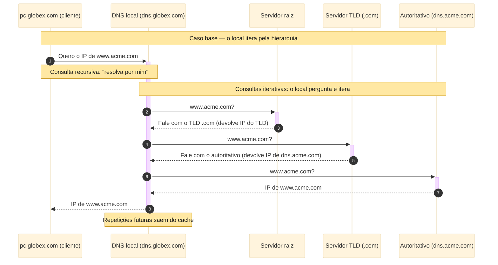
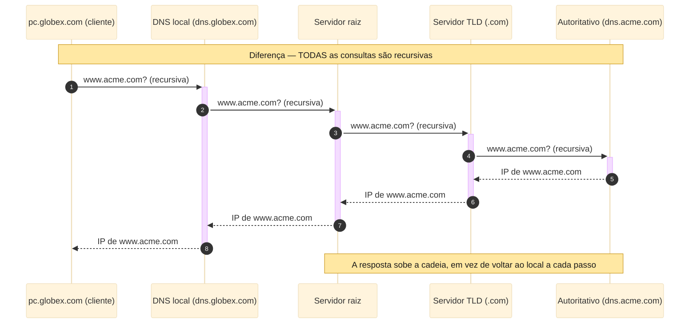
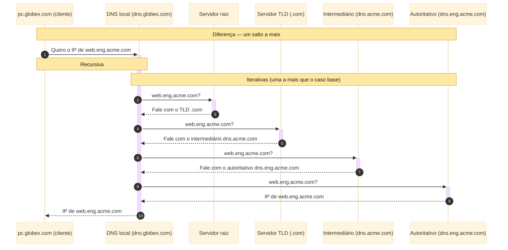
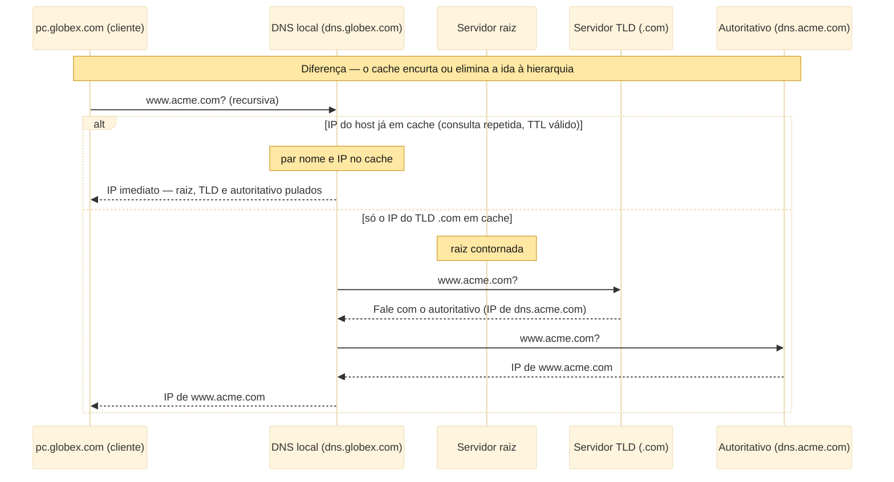
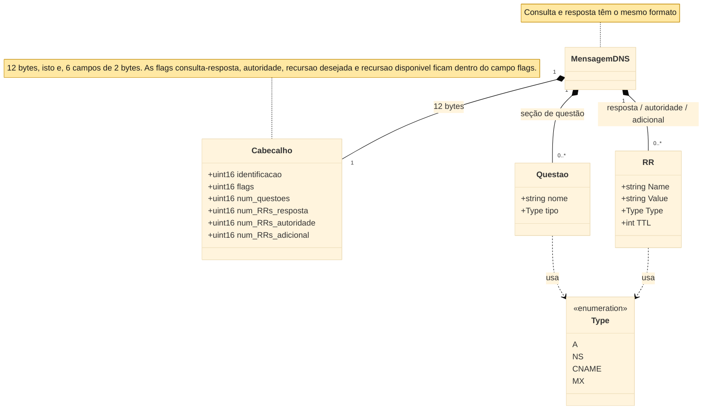
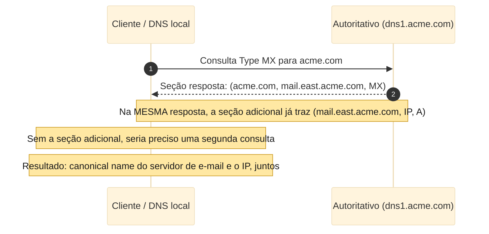
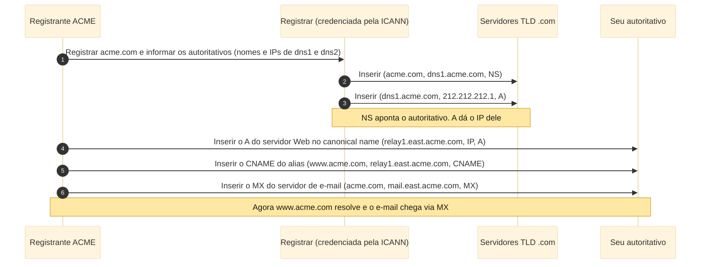

import { Definition, Note, Warning, Figure, Sidenote } from '../../../components/mdx';

Toda vez que você abre um site, sua máquina faz uma pergunta silenciosa antes de qualquer outra coisa: "qual é o endereço IP desse nome?".
Quem responde é o **DNS** (Domain Name System), o serviço de diretório da Internet. Este artigo abre essa caixa-preta. A teoria segue os
fundamentos de Kurose e Ross [@KuroseRoss2021], e cada conceito aparece logo ao lado do comando que o torna visível, com a saída **real**
capturada num Windows usando `nslookup`, o PowerShell e o Wireshark. As saídas foram coletadas em 6 de junho de 2026 e estão reproduzidas
tal como saíram do terminal.

<nav class="paper-toc" aria-label="Sumário">

**Sumário**

- [O problema: dois identificadores](#o-problema-dois-identificadores)
- [O cliente DNS mora na sua máquina](#o-cliente-dns-mora-na-sua-máquina)
- [Os quatro serviços do DNS](#os-quatro-serviços-do-dns)
- [Por que o DNS não é centralizado](#por-que-o-dns-não-é-centralizado)
- [A hierarquia de servidores](#a-hierarquia-de-servidores)
- [A resolução passo a passo](#a-resolução-passo-a-passo)
- [Cache e TTL](#cache-e-ttl)
- [Registros de recurso](#registros-de-recurso)
- [A mensagem DNS](#a-mensagem-dns)
- [Como os registros entram no banco](#como-os-registros-entram-no-banco)
- [Segurança do DNS](#segurança-do-dns)
- [Próximos passos](#próximos-passos)

</nav>

## O problema: dois identificadores

Pessoas são identificadas de várias formas — pelo nome, pelo número de identidade, pelo CPF. Em cada contexto, um identificador serve melhor
que outro. Sistemas automatizados preferem números de tamanho fixo, enquanto pessoas preferem o nome, mais fácil de lembrar. Com os hosts na
Internet acontece o mesmo, e o DNS existe para reconciliar os dois identificadores que todo host carrega.

O primeiro é o **hostname**, como `www.acme.com`. Ele é feito para humanos e por isso é fácil de lembrar, mas traz duas fraquezas para a
rede. Informa quase nada sobre _onde_ o host está, e, por ser alfanumérico e de comprimento variável, é difícil de processar por um
roteador. O segundo é o **endereço IP** (Internet Protocol), quatro bytes como `121.7.106.83`, cada byte em decimal de 0 a 255. Ele tem
estrutura hierárquica rígida e tamanho fixo, exatamente o que o roteador prefere. É hierárquico no sentido de que, lido da esquerda para a
direita, revela informação cada vez mais específica sobre onde o host está, como um endereço postal lido de país a rua.

Conciliar "nome fácil de lembrar" com "endereço que a rede sabe rotear" exige um serviço de diretório que traduza nome em IP. Essa é a
tarefa principal do DNS, que na verdade é duas coisas ao mesmo tempo: um **banco de dados distribuído**, implementado numa hierarquia de
servidores espalhados pelo mundo, e um **protocolo de camada de aplicação** que deixa um host consultar esse banco. O protocolo roda sobre
**UDP** (User Datagram Protocol), na porta **53**, e está especificado nos RFCs 1034 e 1035 [@RFC1034; @RFC1035]. Na prática, os servidores
costumam rodar o software **BIND** (Berkeley Internet Name Domain).

Dá para ver tudo isso de uma vez com um único comando. O `nslookup` pega um nome, pergunta ao servidor DNS e mostra a resposta.

```bat
nslookup www.github.com.
```

```text
Server:  UnKnown
Address:  192.168.40.1

Non-authoritative answer:
Name:    github.com
Address:  140.82.113.4
Aliases:  www.github.com
```

O bloco de cima, com `Server:` e `Address:`, é o **resolver** que respondeu, em geral o roteador da rede ou o DNS do provedor. O nome
aparecer como `UnKnown` não é erro, significa apenas que esse servidor não tem nome reverso configurado. A linha `Non-authoritative answer:`
revela que o IP veio do **cache** do resolver, e não do servidor dono do domínio — esse é o caso comum, e é a primeira manifestação do cache
que veremos em detalhe adiante. Como `www.github.com` é um alias, o Windows mostra o canonical name em `Name:` e o que você digitou em
`Aliases:`.

<Note>
  O ponto final em `www.github.com.` é proposital. Sem ele, o Windows cola o sufixo de busca da sua rede (aqui, `lan`) e pergunta
  `www.github.com.lan` primeiro, sujando o resultado e, mais adiante, a captura do Wireshark. O ponto final diz "este é o nome completo, não
  cole nada".
</Note>

## O cliente DNS mora na sua máquina

O DNS quase nunca aparece sozinho. O **HTTP** (Hypertext Transfer Protocol), o **SMTP** (Simple Mail Transfer Protocol) e outros o chamam
"por baixo" para traduzir o nome que o usuário digitou. Acompanhe o acesso a `www.acme.com/index.html`:

1. A própria máquina do usuário roda o **lado cliente** do DNS. Ele não é um servidor remoto à parte, mora no seu host.
2. O navegador extrai o hostname `www.acme.com` da URL e o entrega ao cliente DNS.
3. O cliente DNS envia uma consulta com esse nome a um servidor DNS.
4. O cliente recebe de volta o IP correspondente ao nome.
5. Só então, de posse do IP, o navegador abre a conexão **TCP** (Transmission Control Protocol) com o servidor HTTP na porta 80.

Como essa tradução acontece **antes** de qualquer dado da aplicação trafegar, o DNS adiciona atraso, às vezes substancial. O que salva é o
cache: o IP procurado quase sempre já está guardado num servidor próximo, o que reduz tanto o atraso médio quanto o tráfego DNS na rede.

Quem é, então, o servidor que respondeu na consulta anterior? O `ipconfig /all` mostra. (Recortei a saída para as linhas que importam e
ocultei endereço físico e identificadores da máquina.)

```bat
ipconfig /all
```

```text
Ethernet adapter Ethernet:

   Connection-specific DNS Suffix  . : lan
   DHCP Enabled. . . . . . . . . . . : Yes
   IPv4 Address. . . . . . . . . . . : 192.168.40.166(Preferred)
   Default Gateway . . . . . . . . . : 192.168.40.1
   DHCP Server . . . . . . . . . . . : 192.168.40.1
   DNS Servers . . . . . . . . . . . : 192.168.40.1
```

A linha `DNS Servers` traz o resolver configurado no adaptador, e ele é o mesmo `192.168.40.1` que apareceu como `Server:` na consulta
anterior. Esse endereço chegou automaticamente via **DHCP** (Dynamic Host Configuration Protocol), o protocolo que distribui as
configurações de rede. É o servidor DNS local, que age como proxy das suas consultas e que veremos melhor quando falarmos da hierarquia.

Para ver que outros protocolos chamam o DNS por baixo, basta dar um `ping`. Ele resolve o nome **antes** de enviar qualquer pacote.

```bat
ping -n 4 www.github.com.
```

```text
Pinging github.com [140.82.113.4] with 32 bytes of data:
Reply from 140.82.113.4: bytes=32 time=50ms TTL=48
Reply from 140.82.113.4: bytes=32 time=38ms TTL=48
Reply from 140.82.113.4: bytes=32 time=36ms TTL=48
Reply from 140.82.113.4: bytes=32 time=37ms TTL=48

Ping statistics for 140.82.113.4:
    Packets: Sent = 4, Received = 4, Lost = 0 (0% loss),
Approximate round trip times in milli-seconds:
    Minimum = 36ms, Maximum = 50ms, Average = 40ms
```

A primeira linha é a prova: `Pinging github.com [140.82.113.4]`. O IP entre colchetes só pode estar ali porque o nome **já foi resolvido por
DNS** antes do primeiro pacote. Repare também que, embora eu tenha digitado `www.github.com`, o `ping` exibe o canonical name `github.com`,
o mesmo encadeamento alias → canonical name que a primeira consulta revelou.

## Os quatro serviços do DNS

Além da tradução nome → IP, o DNS oferece outros três serviços. Usando a empresa fictícia **Acme** (`acme.com`):

1. **Tradução nome → IP**, o serviço principal já visto.
2. **Alias de host.** Um servidor real costuma ter um canonical name complicado, como `relay1.east.acme.com`. Para os usuários, definem-se
   aliases mais simples, como `www.acme.com`. O nome bonito que você digita é, por baixo, um apontamento para o canonical name de verdade.
3. **Alias de servidor de e-mail.** A mesma ideia aplicada ao e-mail. O endereço deve ser simples (`bob@acme.com`) mesmo que o servidor de
   e-mail real tenha nome complicado. É o registro **MX** (Mail Exchange) que viabiliza isso, e ele permite que o servidor Web e o de e-mail
   compartilhem o mesmo alias `acme.com`.
4. **Load distribution.** Sites movimentados são replicados em vários servidores, cada um com um IP. Um único alias é associado a um
   **conjunto** de endereços, e a cada consulta o servidor devolve o conjunto inteiro mas rotaciona a ordem (round-robin). Como o cliente
   costuma usar o primeiro endereço da lista, as requisições se espalham pelas réplicas.

O alias de host fica claro pedindo diretamente o registro CNAME e, num caso rico, observando a cadeia inteira que uma CDN monta:

```bat
nslookup -type=CNAME www.github.com.
```

```text
Server:  UnKnown
Address:  192.168.40.1

www.github.com  canonical name = github.com
```

A expressão `canonical name =` é literalmente o canonical name do conceito. Agora o caso rico, com o `Resolve-DnsName` do PowerShell:

```powershell
Resolve-DnsName -Name www.amazon.com -Type A
```

```text
Name                           Type   TTL   Section    NameHost
----                           ----   ---   -------    --------
www.amazon.com                 CNAME  54    Answer     tp.47cf2c8c9-frontier.amazon.com
tp.47cf2c8c9-frontier.amazon.c CNAME  54    Answer     cf.47cf2c8c9-frontier.amazon.com
om

Name       : cf.47cf2c8c9-frontier.amazon.com
QueryType  : A
TTL        : 58
Section    : Answer
IP4Address : 13.225.51.229
```

O `www.amazon.com` é só o alias na ponta de uma corrente: ele aponta para `tp.47cf2c8c9-frontier.amazon.com`, que aponta para
`cf.47cf2c8c9-frontier.amazon.com`, que enfim resolve para o IP `13.225.51.229` da CloudFront, a CDN da própria Amazon. O PowerShell mostra
os dois **CNAMEs** numa tabela (todos têm a coluna `NameHost`) e o **registro A** do fim num bloco separado, porque ele traz `IP4Address` em
vez de `NameHost`. O IP e os TTLs mudam a cada consulta — o que importa é a corrente alias → canonical name chegar ao endereço.

O alias de servidor de e-mail aparece na consulta MX:

```bat
nslookup -type=MX gmail.com.
```

```text
Server:  UnKnown
Address:  192.168.40.1

Non-authoritative answer:
gmail.com       MX preference = 10, mail exchanger = alt1.gmail-smtp-in.l.google.com
gmail.com       MX preference = 40, mail exchanger = alt4.gmail-smtp-in.l.google.com
gmail.com       MX preference = 30, mail exchanger = alt3.gmail-smtp-in.l.google.com
gmail.com       MX preference = 20, mail exchanger = alt2.gmail-smtp-in.l.google.com
gmail.com       MX preference = 5, mail exchanger = gmail-smtp-in.l.google.com
```

Cada `mail exchanger` é o canonical name de um servidor de e-mail, e o `preference` é a prioridade — quanto menor, mais preferencial. O
servidor de menor preferência aqui é o `gmail-smtp-in.l.google.com`, com preferência 5.

O load distribution fica visível quando se consulta um nome muito replicado duas vezes seguidas:

```bat
nslookup yahoo.com.
```

```text
Non-authoritative answer:
Name:    yahoo.com
Addresses:  2001:4998:24:120d::1:1
          2001:4998:124:1507::f000
          2001:4998:44:3507::8001
          2001:4998:44:3507::8000
          2001:4998:124:1507::f001
          2001:4998:24:120d::1:0
          74.6.143.26
          74.6.143.25
          98.137.11.164
          98.137.11.163
          74.6.231.21
          74.6.231.20
```

Rodando o mesmo comando de novo, a ordem muda:

```text
Non-authoritative answer:
Name:    yahoo.com
Addresses:  2001:4998:24:120d::1:0
          2001:4998:124:1507::f001
          2001:4998:44:3507::8000
          2001:4998:44:3507::8001
          2001:4998:124:1507::f000
          2001:4998:24:120d::1:1
          74.6.231.20
          74.6.143.26
          74.6.143.25
          98.137.11.164
          98.137.11.163
          74.6.231.21
```

Com mais de um endereço, o rótulo muda de `Address:` (singular) para `Addresses:` (plural). É o load distribution: um único nome associado a
um conjunto de servidores, aqui replicados em IPv6 (os `2001:4998:...`, registros **AAAA**) e IPv4 (os `74.6...` e `98.137...`, registros
**A**). Entre as duas execuções, o conteúdo é o mesmo mas a ordem foi rotacionada. Como o cliente quase sempre usa o primeiro endereço,
clientes distintos acabam em réplicas distintas e a carga se reparte.

<Note>
  O DNS é um protocolo de camada de aplicação por dois motivos: roda entre sistemas finais no paradigma cliente-servidor e depende de um
  protocolo de transporte fim a fim (o UDP) para carregar suas mensagens. Mas há uma diferença em relação à Web ou ao e-mail — ninguém "usa"
  o DNS diretamente. Ele é uma função-núcleo de suporte, acionada por outras aplicações. É uma decisão de projeto deliberada: empurrar uma
  função crítica para a borda da rede, nos hosts, mantendo o núcleo simples.
</Note>

## Por que o DNS não é centralizado

O projeto ingênuo seria um único servidor DNS com todos os mapeamentos, recebendo todas as consultas do mundo. É simples, mas inviável, por
quatro motivos [@KuroseRoss2021]:

1. **Ponto único de falha.** Se esse servidor cai, a Internet inteira para.
2. **Volume de tráfego.** Um só servidor teria de atender a todas as consultas DNS do planeta.
3. **Banco de dados centralizado e distante.** Nenhum servidor consegue ficar próximo de todos os clientes. Um servidor único em Nova York
   faria consultas vindas da Austrália atravessarem o globo.
4. **Manutenção.** Um banco com os registros de todos os hosts seria gigantesco e exigiria atualização constante.

Centralizar não escala. Por isso o DNS é distribuído por concepção de projeto.

## A hierarquia de servidores

O DNS usa um grande número de servidores organizados hierarquicamente. Nenhum servidor isolado tem todos os mapeamentos — eles são
particionados em três classes, mais o servidor local, que fica fora da hierarquia.

- **Servidores raiz.** Há mais de mil instâncias pelo mundo, cópias de 13 servidores-raiz distintos, coordenados pela **IANA** (Internet
  Assigned Numbers Authority). Eles fornecem os IPs dos servidores TLD.
- **Servidores TLD** (Top-Level Domain). Um conjunto para cada domínio de alto nível: `com`, `org`, `net`, `edu`, e os de país (`br`, `fr`,
  `jp`). A Verisign mantém os de `.com`, por exemplo. Eles fornecem os IPs dos servidores autoritativos.
- **Servidores autoritativos.** Toda organização com hosts publicamente acessíveis publica registros que mapeiam nomes para IPs, e o
  servidor autoritativo abriga esses registros. Pode ser próprio ou hospedado num provedor, em geral com um primário e um secundário.

<Definition title="Servidor DNS local">
  O servidor que cada ISP (Internet Service Provider) oferece e que o host recebe via DHCP. Ele não pertence à hierarquia: fica "próximo" do
  host e age como **proxy**, recebendo a consulta do host e a retransmitindo para a raiz, o TLD e o autoritativo.
</Definition>

## A resolução passo a passo

Imagine `pc.globex.com` querendo o IP de `www.acme.com`. A consulta vai primeiro ao servidor local `dns.globex.com`, que percorre a
hierarquia por ele:

1. `pc.globex.com` → `dns.globex.com`: consulta com o nome `www.acme.com`.
2. `dns.globex.com` → servidor **raiz**.
3. A raiz identifica o sufixo `.com` e devolve os IPs dos servidores **TLD** de `.com`.
4. `dns.globex.com` → servidor **TLD**.
5. O TLD identifica `acme.com` e devolve o IP do **autoritativo** `dns.acme.com`.
6. `dns.globex.com` → `dns.acme.com`.
7. O autoritativo devolve o IP de `www.acme.com`.
8. `dns.globex.com` → `pc.globex.com`: entrega o IP ao host.

São quatro consultas e quatro respostas, **oito mensagens** para resolver um nome sem cache.

<Figure caption="Figura 1 — Resolução iterativa típica sem cache: só a primeira consulta é recursiva, e o servidor local pergunta a cada nível (raiz, TLD, autoritativo).">



</Figure>

Há dois tipos de consulta em jogo. Numa consulta **recursiva**, o host pede ao servidor que obtenha o mapeamento por ele e devolva a
resposta final. Numa consulta **iterativa**, cada servidor responde com "não sei, mas pergunte àquele ali", e quem itera é o servidor local.
Em teoria, qualquer consulta poderia ser de um ou outro tipo. Na prática, o padrão é fixo: host → local é recursiva, e o resto é iterativo.

<Figure caption="Figura 2 — Resolução totalmente recursiva: cada servidor repassa a consulta ao próximo e a resposta sobe a cadeia. O local não itera.">



</Figure>

Na prática, o servidor TLD muitas vezes não conhece diretamente o autoritativo, só um servidor **intermediário**. Por exemplo, dentro da
Acme, `dns.acme.com` é intermediário e o departamento de engenharia tem seu próprio autoritativo `dns.eng.acme.com`. Resolver
`web.eng.acme.com` exige um salto a mais, somando **dez mensagens**.

<Figure caption="Figura 3 — Variante com servidor intermediário: o TLD aponta o intermediário, não o autoritativo, gerando dez mensagens.">



</Figure>

Dá para fazer esse caminho com as próprias mãos. Em vez de deixar o servidor local iterar por nós, perguntamos um nível de cada vez, sempre
sem recursão (`-norecurse`) e pedindo os servidores de nome (`-type=NS`). Começamos por um servidor raiz:

```bat
nslookup -norecurse -type=NS github.com. 198.41.0.4
```

```text
Server:  UnKnown
Address:  198.41.0.4

com     nameserver = a.gtld-servers.net
com     nameserver = b.gtld-servers.net
com     nameserver = l.gtld-servers.net
[... 13 servidores .com no total ...]
a.gtld-servers.net      internet address = 192.5.6.30
l.gtld-servers.net      internet address = 192.41.162.30
[... registros A e AAAA de cola de cada um ...]
```

A raiz não sabe o IP de `github.com`, então devolve um **referral** para os servidores do TLD `.com`. Repare nas duas formas de linha:
`nameserver =` é um registro **NS** (o servidor do próximo nível), e `internet address =` é o registro **A** de cola (_glue_) com o IP desse
servidor. Pegamos um dos IPs do TLD (`192.41.162.30`, do `l.gtld-servers.net`) e perguntamos a ele:

```bat
nslookup -norecurse -type=NS github.com. 192.41.162.30
```

```text
Server:  UnKnown
Address:  192.41.162.30

github.com      nameserver = ns-520.awsdns-01.net
github.com      nameserver = ns-421.awsdns-52.com
[... 8 servidores autoritativos no total ...]
ns-421.awsdns-52.com    internet address = 205.251.193.165
```

O TLD também não sabe o IP final, mas devolve outro referral, agora para os servidores **autoritativos** de `github.com`, e já manda no glue
o IP de um deles. Usamos esse IP (`205.251.193.165`) no último salto, agora pedindo o registro **A** e ligando a depuração (`-debug`) para
ver as flags:

```bat
nslookup -debug -norecurse -type=A github.com. 205.251.193.165
```

```text
Got answer:
    HEADER:
        opcode = QUERY, id = 2, rcode = NOERROR
        header flags:  response, auth. answer
        questions = 1,  answers = 1,  authority records = 8,  additional = 0
    QUESTIONS:
        github.com, type = A, class = IN
    ANSWERS:
    ->  github.com
        internet address = 140.82.114.3
        ttl = 60 (1 min)
    [... 8 AUTHORITY RECORDS (NS) ...]

Name:    github.com
Address:  140.82.114.3
```

O padrão referral → referral → resposta é exatamente a resolução iterativa das oito mensagens. Compare os mundos: nos dois primeiros saltos
não havia `auth. answer`, só `nameserver =`, porque eram delegações. No último salto aparece a flag `auth. answer` e o IP vem na seção
`ANSWERS`. Esse IP autoritativo, `140.82.114.3`, é até diferente do `140.82.113.4` que o resolver local nos deu lá no começo — o GitHub
publica várias réplicas, e o que nos chega depende de qual servidor responde e do que está em cache.

<Warning>
  No Windows, antes de cada resposta útil, o `nslookup` imprime um bloco de ruído: ele tenta descobrir o nome reverso do servidor que você
  apontou e falha, mostrando linhas `in-addr.arpa ...`, `(root) ...` ou um `rcode = REFUSED`. Ignore esse bloco do topo e o `Server:
  UnKnown` — a resposta que importa vem **depois** dele. Os trechos acima já estão recortados nesse ponto.
</Warning>

## Cache e TTL

Quando um servidor recebe uma resposta, ele guarda o par nome → IP em cache na memória local. Numa próxima consulta para o mesmo nome, ele
devolve o IP do cache, mesmo sem ter autoridade sobre aquele nome. Os mapeamentos não são permanentes: cada registro tem um prazo de
validade, o **TTL** (Time To Live), com frequência da ordem de dois dias, após o qual a entrada é descartada. Como os servidores locais
também guardam em cache os IPs dos servidores TLD, os servidores raiz acabam sendo contornados em praticamente todas as consultas.

<Figure caption="Figura 4 — Atalhos por cache: uma resposta repetida vem direto do local, pulando a hierarquia. Com só o TLD em cache, apenas a raiz é contornada.">



</Figure>

Para ver o TTL contando, o segredo é escolher um nome com TTL longo, como o apex `globo.com`. Primeiro limpamos o cache do cliente e
povoamos com uma consulta (no PowerShell, como administrador):

```powershell
Clear-DnsClientCache
Resolve-DnsName globo.com
```

```text
Name                                           Type   TTL   Section    IPAddress
----                                           ----   ---   -------    ---------
globo.com                                      A      2813  Answer     186.192.83.12
```

Agora lemos a entrada já dentro do cache do cliente:

```powershell
Get-DnsClientCache -Name globo.com
```

```text
Entry           RecordName      Record Status   Section TimeTo Data   Data
                                Type                    Live   Length
-----           ----------      ------ ------    ------- ------ ------ ----
globo.com       globo.com       A      Success   Answer    2812      4 186.192.83.12
```

Essa tabela é o registro de recurso em colunas: `RecordName` é o nome, `Data` é o valor (o IP), `RecordType` é o tipo (`A`) e `TimeToLive` é
o TTL em segundos, o número que vai cair. Esperamos vinte segundos sem consultar o nome de novo, porque qualquer nova consulta repõe a
entrada, e lemos outra vez:

```powershell
Start-Sleep -Seconds 20
Get-DnsClientCache -Name globo.com
```

```text
globo.com       globo.com       A      Success   Answer    2792      4 186.192.83.12
```

O `TimeToLive` caiu de 2812 para 2792, cerca de vinte segundos a menos. Quando chega a zero, a entrada é descartada. Esse mesmo cache também
derruba o atraso, e dá para medir com o `Measure-Command`: a primeira consulta vai à rede, a segunda vem do cache.

```powershell
Clear-DnsClientCache
Measure-Command { Resolve-DnsName -Name www.rnp.br -Type A -DnsOnly }
Measure-Command { Resolve-DnsName -Name www.rnp.br -Type A -DnsOnly }
```

```text
TotalMilliseconds : 21.806     <- 1ª consulta (foi à rede)
TotalMilliseconds : 14.0728    <- 2ª consulta (veio do cache)
```

A segunda consulta nem sai da máquina, porque o Windows já guardou o par nome → IP no cache do cliente. A queda — aqui de ~22 ms para ~14 ms
— é o ganho que o cache traz: menos atraso e menos tráfego. Usei `www.rnp.br`, um nome menos popular, de propósito: um nome muito visitado
já estaria quente no resolver do provedor, e as duas medições sairiam quase iguais.

## Registros de recurso

O banco de dados do DNS é feito de **registros de recurso** (RR).

<Definition title="Registro de recurso (RR)">
  Uma tupla de quatro campos `(Name, Value, Type, TTL)`. O `TTL` diz por quanto tempo o registro pode ficar em cache. O significado de
  `Name` e `Value` depende do `Type`.
</Definition>

São quatro os tipos que sustentam tudo o que vimos:

- **A** — `Name` é um host e `Value` é o seu IP. É o mapeamento-padrão nome → IP. Ex.: `(relay1.east.acme.com, 145.37.93.126, A)`.
- **NS** — `Name` é um domínio e `Value` é o nome de um servidor autoritativo daquele domínio. Encaminha a consulta pela cadeia. Ex.:
  `(acme.com, dns1.acme.com, NS)`.
- **CNAME** — `Value` é o canonical name correspondente ao alias em `Name`. Ex.: `(acme.com, relay1.east.acme.com, CNAME)`.
- **MX** — `Value` é o canonical name do servidor de e-mail cujo alias está em `Name`. Ex.: `(acme.com, mail.east.acme.com, MX)`.

O detalhe elegante é que o **mesmo alias** `acme.com` leva a destinos diferentes conforme o tipo consultado: pede-se **MX** para achar o
servidor de e-mail e **CNAME** para achar o servidor Web. É isso que permite e-mail e Web compartilharem o nome. Vimos os quatro tipos em
ação: o A na primeira consulta, o CNAME na cadeia da Amazon, o MX no Gmail e o NS nos referrals da hierarquia.

Onde os registros ficam depende da autoridade. Se um servidor tem autoridade sobre um host, ele guarda o registro **A** daquele host. Se não
tem, guarda um par que aponta o caminho: um **NS** (domínio → nome do autoritativo) e um **A** que dá o IP desse autoritativo. Foi
exatamente esse par NS + A de cola que vimos chegar em cada referral da hierarquia — é ele que faz a iteração funcionar.

## A mensagem DNS

Só existem duas mensagens DNS, consulta e resposta, e ambas têm o mesmo formato: um cabeçalho de 12 bytes seguido de quatro seções de dados.

<Figure caption="Figura 5 — Estrutura da mensagem DNS: cabeçalho de 12 bytes mais quatro seções, cujas seções carregam registros de recurso.">



</Figure>

O cabeçalho tem seis campos de 2 bytes: a **identificação** (16 bits), um número copiado da consulta para a resposta para o cliente casar
uma com a outra; o campo de **flags** (16 bits); e quatro **contadores** (questões, RRs de resposta, de autoridade e adicionais). Dentro do
campo de flags vivem, entre outros bits, o de consulta/resposta, o de autoridade, o de recursão desejada e o de recursão disponível. As
quatro seções que seguem o cabeçalho são a **questão** (o nome e o tipo consultados), a **resposta** (os RRs do nome), a **autoridade**
(registros de outros servidores autoritativos) e a **adicional** (registros úteis extras).

Com o Wireshark dá para ver cada um desses campos no pacote real. Gerei uma consulta limpa com `ipconfig /flushdns` seguido de
`nslookup www.example.com.` e filtrei por `dns`. Os blocos abaixo reproduzem a árvore do dissecador do Wireshark para o par capturado (o
`Transaction ID` e a porta de origem variam a cada execução). Primeiro a consulta:

```text
User Datagram Protocol, Src Port: 52344, Dst Port: 53
Domain Name System (query)
    Transaction ID: 0x1a2b
    Flags: 0x0100 Standard query
        0... .... .... .... = Response: Message is a query
        .... ...1 .... .... = Recursion desired: Do query recursively
    Questions: 1
    Answer RRs: 0
    Authority RRs: 0
    Additional RRs: 0
    Queries
        www.example.com: type A, class IN
```

Em `User Datagram Protocol` lê-se a confirmação de que o DNS roda sobre UDP, com a porta 53 num dos lados. O cabeçalho traz o
`Transaction ID`, o campo `Flags` com os bits individuais, e os quatro contadores. Numa consulta, só fazem sentido os bits `Response` (aqui
0, é uma pergunta) e `Recursion desired`. Agora a resposta:

```text
Domain Name System (response)
    Transaction ID: 0x1a2b
    Flags: 0x8180 Standard query response, No error
        1... .... .... .... = Response: Message is a response
        .... .0.. .... .... = Authoritative: Server is not an authority for domain
        .... ...1 .... .... = Recursion desired: Do query recursively
        .... .... 1... .... = Recursion available: Server can do recursive queries
    Questions: 1
    Answer RRs: 1
    Queries
        www.example.com: type A, class IN
    Answers
        www.example.com: type A, class IN, addr 172.66.147.243
            Time to live: 60
```

O `Transaction ID` é o mesmo da consulta, que é como o cliente casa a resposta com a pergunta. O bit `Response` agora é 1, `Answer RRs` é 1,
e na seção `Answers` aparece o registro A com seu `Time to live`. Repare que o bit `Authoritative` é 0: a resposta veio do resolver local,
do cache, não do servidor dono do domínio — o mesmo `Non-authoritative answer:` que o `nslookup` mostrava lá no início.

A resposta a uma consulta MX ilustra para que serve a seção adicional. Na seção de resposta vem o canonical name do servidor de e-mail, e a
seção adicional já traz o registro A com o IP dele, poupando uma segunda consulta.

<Figure caption="Figura 6 — Consulta MX: a resposta traz o canonical name do servidor de e-mail e o seu IP de uma só vez, na seção adicional.">



</Figure>

No Wireshark, a resposta da consulta `nslookup -type=MX gmail.com.` mostra isso na árvore (quando o servidor envia a cola):

```text
Domain Name System (response)
    Answers
        gmail.com: type MX, class IN, preference 5, mx gmail-smtp-in.l.google.com
    Additional records
        gmail-smtp-in.l.google.com: type A, class IN, addr 142.250.xxx.xxx
```

Vale lembrar que nem todo servidor manda os registros A na seção adicional. Quando não vêm, o cliente faz consultas A separadas depois — é
normal, não é erro.

Por fim, o Wireshark deixa visível a afirmação de que o DNS adiciona atraso **antes** de a aplicação trafegar. Abrindo `github.com` no
navegador e filtrando a consulta DNS junto com o primeiro SYN do TCP, a ordem fica clara:

```text
No.   Time        Protocol  Info
12    0.000000    DNS       Standard query 0x1a2b A github.com
13    0.018431    DNS       Standard query response 0x1a2b A github.com A 140.82.113.4
14    0.019002    TCP       52900 > 443 [SYN] Seq=0
```

A resposta DNS (pacote 13) chega antes, e só depois o navegador abre a conexão TCP (pacote 14, o `[SYN]`) para a porta 443 do **mesmo IP**
que o DNS entregou. A coluna `Time` confirma a sequência.

## Como os registros entram no banco

Até aqui vimos como os registros são lidos. Eles entram assim. Primeiro registra-se o domínio (por exemplo `acme.com`) num **registrar**,
uma organização credenciada pela **ICANN** (Internet Corporation for Assigned Names and Numbers) que verifica a unicidade do nome e cobra
uma taxa. Você informa o nome e o IP dos seus servidores autoritativos primário e secundário. O registrar insere, nos servidores TLD `.com`,
um par NS + A para cada um. E você insere, nos seus próprios servidores autoritativos, o registro A do servidor Web no canonical name, o
CNAME que liga o alias ao canonical name e o MX do servidor de e-mail. Há ainda a opção **UPDATE** do protocolo para adicionar e remover
registros dinamicamente [@RFC2136].

<Figure caption="Figura 7 — Inserção de registros: o registrar insere NS e A no TLD, e o dono do domínio insere A, CNAME e MX no seu autoritativo.">



</Figure>

## Segurança do DNS

Como o DNS é infraestrutura crítica, ele é alvo. Os ataques discutidos por Kurose e Ross são quatro [@KuroseRoss2021]. Um **DDoS**
(Distributed Denial of Service) **contra os servidores raiz** tenta inundá-los de pacotes. O ataque de 2002, com uma botnet enviando ICMP
ping aos 13 servidores raiz, teve impacto mínimo por dois motivos que já praticamos: filtros bloqueando o ICMP, e os servidores locais já
terem os IPs dos TLDs em cache, contornando a raiz. Um **DDoS contra os servidores TLD** é mais eficaz, porque é mais difícil filtrar
consultas DNS legítimas e os TLDs não são contornados tão facilmente — foi o que derrubou a **Dyn** em 2016, via a botnet **Mirai** de cerca
de cem mil dispositivos IoT, tirando do ar Amazon, Twitter, Netflix, GitHub e Spotify por quase um dia [@Antonakakis2017]. Há ainda o
**man-in-the-middle**, em que o atacante intercepta consultas e devolve respostas falsas, e o **cache poisoning**, em que ele faz um
servidor guardar respostas falsas. A defesa de fundo é o **DNSSEC** (DNS Security Extensions) [@RFC4033].

A fragilidade fica clara observando dois campos no Wireshark. O `Transaction ID` (`dns.id`) tem só 16 bits, ou seja, 65.536 valores
possíveis. O resolver aceita a resposta cujo ID bate com o da pergunta, e um identificador tão curto abre espaço para um atacante tentar
adivinhar o ID e responder antes do servidor legítimo. A defesa concreta é aleatorizar a **porta de origem** do UDP (`udp.srcport`), que
soma entropia ao ID e dificulta muito a adivinhação combinada. O ponto é que nada aqui autentica a resposta: quem responder com o ID certo
"ganha". É essa lacuna que o DNSSEC fecha.

O DNSSEC assina criptograficamente os registros. Pedindo a um resolver validador (`1.1.1.1`) o registro A com a flag `-DnssecOk`, vem junto
a assinatura:

```powershell
Resolve-DnsName -Name cloudflare.com -Type A -DnssecOk -Server 1.1.1.1
```

```text
Name                                           Type   TTL   Section    IPAddress
----                                           ----   ---   -------    ---------
cloudflare.com                                 A      233   Answer     104.16.132.229
cloudflare.com                                 A      233   Answer     104.16.133.229

Name        : cloudflare.com
QueryType   : RRSIG
TTL         : 233
Section     : Answer
TypeCovered : A
Algorithm   : 13
LabelCount  : 2
OriginalTtl : 300
Expiration  : 6/7/2026 5:31:00 PM
Signed      : 6/5/2026 3:31:00 PM
Signer      : cloudflare.com
Signature   : {44, 19, 23, 237...}
```

Os dois primeiros registros são os A comuns. O que muda é o **RRSIG** abaixo, a assinatura do conjunto A. O campo `TypeCovered : A` diz que
a assinatura cobre justamente esses registros A, `Algorithm : 13` é o algoritmo de chave (ECDSA P-256 com SHA-256), e o par `Signed` /
`Expiration` mostra que toda assinatura DNSSEC tem validade, aqui de cerca de 48 horas, o que obriga a zona a reassinar periodicamente. As
chaves públicas da zona vêm na consulta DNSKEY:

```powershell
Resolve-DnsName -Name cloudflare.com -Type DNSKEY -Server 1.1.1.1
```

```text
Name                                     Type   TTL   Section    Flags  Protocol Algorithm      Key
----                                     ----   ---   -------    -----  -------- ---------      ---
cloudflare.com                           DNSKEY 604   Answer     256    DNSSEC   13             {160, 147, 17, 17...}
cloudflare.com                           DNSKEY 604   Answer     257    DNSSEC   13             {153, 219, 44, 193...}
```

A coluna `Flags` separa os dois papéis: `257` é a **KSK** (Key Signing Key), a chave que assina as outras chaves, e `256` é a **ZSK** (Zone
Signing Key), a que assina os demais registros — foi uma ZSK que gerou o RRSIG do A acima. O contraste que ensina tudo vem de um domínio com
assinatura propositalmente quebrada, mantido para teste:

```powershell
Resolve-DnsName -Name dnssec-failed.org -DnssecOk -Server 1.1.1.1
```

```text
Resolve-DnsName : dnssec-failed.org : DNS server failure
At line:1 char:1
+ Resolve-DnsName -Name dnssec-failed.org -DnssecOk -Server 1.1.1.1
    + CategoryInfo          : ResourceUnavailable: (dnssec-failed.org:String) [Resolve-DnsName], Win32Exception
    + FullyQualifiedErrorId : RCODE_SERVER_FAILURE,Microsoft.DnsClient.Commands.ResolveDnsName
```

O `DNS server failure` e o `RCODE_SERVER_FAILURE` são o **SERVFAIL** do DNS: o resolver validador tentou conferir a assinatura, ela não
fechou, e ele preferiu devolver erro a entregar um dado possivelmente forjado. A validação **bloqueia** o dado em vez de repassá-lo.

<Warning>
  O resultado depende do resolver. Contra `1.1.1.1` ou `8.8.8.8`, que validam DNSSEC, ocorre o SERVFAIL. Contra um resolver que não valida,
  `dnssec-failed.org` pode resolver normalmente — e isso mesmo é o ensinamento: a proteção só existe se o resolver validar.
</Warning>

## Próximos passos

Este laboratório parou de propósito antes do "pesado". Quando o DNS se juntar aos próximos assuntos, dá para aprofundar montando um
**servidor autoritativo de verdade** (com BIND ou `dnsmasq` num Linux ou no WSL), cadastrando zonas próprias e apontando o resolver da
máquina para ele, de modo que a inserção de registros aconteça num servidor real. Também vale capturar e comparar **DNS over HTTPS** (DoH) e
**DNS over TLS** (DoT) contra o DNS clássico na porta 53, e completar o ciclo de inserção de registros pelo lado do registrar e pela opção
de **UPDATE** dinâmico [@RFC2136].

## Referências
