import { Definition, Note, Warning, Figure, Sidenote } from '../../../components/mdx';

Every retrieval of a web page entails a brief textual exchange that remains invisible to the user. The local machine opens a connection and
emits a small number of lines in plain ASCII, and a server responds in kind, with the requested page attached. That exchange is governed by
**HTTP** (the HyperText Transfer Protocol), the application-layer protocol at the heart of the Web. This article examines that exchange line
by line. The theory follows the fundamentals of Kurose and Ross [@KuroseRoss2016], and each concept is presented alongside the command that
makes it observable, with the **real** output captured on a Windows machine using `curl`. The outputs were collected on June 17, 2026 with
`curl.exe` 8.19.0, and are reproduced as they left the terminal, trimmed of curl's progress meter and, in the longer blocks, repeated
boilerplate headers — retaining the lines that matter.

<nav class="paper-toc" aria-label="Contents">

**Contents**

- [The problem: from a click to a conversation](#the-problem-from-a-click-to-a-conversation)
- [HTTP over TCP and the page, object, URL vocabulary](#http-over-tcp-and-the-page-object-url-vocabulary)
- [Stateless and client-server](#stateless-and-client-server)
- [Non-persistent versus persistent connections and the RTT account](#non-persistent-versus-persistent-connections-and-the-rtt-account)
- [The HTTP message: request line, headers, methods, status codes](#the-http-message-request-line-headers-methods-status-codes)
- [Cookies: four components and a real Set-Cookie cycle](#cookies-four-components-and-a-real-set-cookie-cycle)
- [Web caching, the numeric example, CDNs, and the conditional GET](#web-caching-the-numeric-example-cdns-and-the-conditional-get)
- [HTTP today: HTTPS, the 2022 RFC revision, and HTTP/2 and /3](#http-today-https-the-2022-rfc-revision-and-http2-and-3)
- [Next steps](#next-steps)

</nav>

## The problem: from a click to a conversation

Until the early 1990s the Internet was mostly a tool for researchers and university students: remote login, file transfer, news and e-mail.
Useful, but essentially unknown to the public. What changed everything was the **World Wide Web**, which arrived in the early 1990s and was
the first Internet application to capture the general public's attention. Its principal appeal is that the Web operates **on demand**:
content is delivered when it is requested, unlike broadcast radio and television, which require tuning in when the content provider decides.

At the center of all of this is a single application-layer protocol, and it is the one this article dissects. HTTP is implemented in two
programs, a **client** and a **server**, running on different end systems, that communicate by exchanging **HTTP messages**. The protocol
defines two things: the **structure** of those messages and **how** the client and server exchange them. Everything below is a means of
rendering those two definitions observable.

<Note>
  Commands were run as `curl.exe` on Windows. In PowerShell the bare name `curl` is an alias for `Invoke-WebRequest`, a different tool that
  returns objects rather than the raw bytes on the wire, so the lab uses `curl.exe` explicitly to obtain the real HTTP conversation. The blocks
  below keep curl's connection trace (the `*` lines) and the request (`>`) and response (`<`) lines, dropping the progress meter and, in the
  longer exchanges, repeated boilerplate headers.
</Note>

## HTTP over TCP and the page, object, URL vocabulary

Some vocabulary precedes the protocol. A **Web page** (also called a **document**) consists of **objects**. An object is simply a file — an
**HTML** (HyperText Markup Language) file, a JPEG image, a Java applet, a video clip — addressable by a single **URL** (Uniform Resource
Locator). Most pages are a **base HTML file** plus several referenced objects: a page with HTML text and five JPEG images has **six
objects**, the base file plus the five images, and the base file references the others by their URLs.

<Definition title="Object">
  A file addressable by a single URL. A URL has two components, the **hostname** of the server that houses the object and the **path name**
  of the object. In `http://www.someSchool.edu/someDepartment/picture.gif` the hostname is `www.someSchool.edu` and the path is
  `/someDepartment/picture.gif`.
</Definition>

Because browsers (Internet Explorer, Firefox) implement the **client** side of HTTP, in the context of the Web the terms _browser_ and
_client_ are used interchangeably. Web servers, which implement the **server** side and house the objects, are programs like **Apache** and
**Microsoft Internet Information Server**.

<Figure caption="Figure 1 — Anatomy of a Web page: one page resolves to a base HTML file plus referenced objects, each addressed by its own URL of hostname plus path name." zoomable>

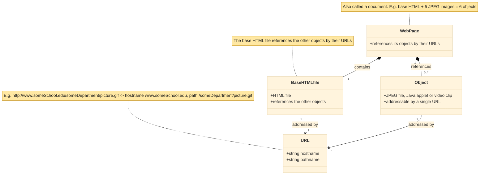

</Figure>

The decisive design choice is the transport. HTTP uses **TCP** (Transmission Control Protocol) as its underlying transport, not **UDP**
(User Datagram Protocol). The HTTP client **first initiates** a TCP connection with the server, and once it is established both sides access
TCP through their **socket** interfaces. The client sends request messages into its socket and receives response messages from it; the
server does the mirror image. TCP gives HTTP a **reliable** data-transfer service, so each request and response eventually arrives
**intact** — and that is the great advantage of a layered architecture: HTTP need not concern itself with lost or reordered data, because
that is TCP's responsibility.

The entire exchange is observable with a single command. `curl -v` opens the TCP connection, sends the request, and prints every line that
crosses the wire. In the following invocation it requests the root object of `example.com`, posing as a Firefox browser with `-A`.

```text
curl.exe -v --http1.1 -A "Mozilla/5.0" http://example.com/
```

```text
* Host example.com:80 was resolved.
* IPv6: (none)
* IPv4: 104.20.23.154, 172.66.147.243
*   Trying 104.20.23.154:80...
* Established connection to example.com (104.20.23.154 port 80) from 192.168.40.166 port 57087
* using HTTP/1.x
> GET / HTTP/1.1
> Host: example.com
> User-Agent: Mozilla/5.0
> Accept: */*
>
* Request completely sent off
< HTTP/1.1 200 OK
< Date: Thu, 18 Jun 2026 02:36:51 GMT
< Content-Type: text/html
< Transfer-Encoding: chunked
< Connection: keep-alive
< Server: cloudflare
< Last-Modified: Wed, 17 Jun 2026 20:54:39 GMT
< Allow: GET, HEAD
< Accept-Ranges: bytes
< Age: 2040
< cf-cache-status: HIT
< CF-RAY: a0d6e8a2e8c5bacc-IAD
<
* Connection #0 to host example.com:80 left intact
<!doctype html><html lang="en"><head><title>Example Domain</title>...</body></html>
```

The entire vocabulary is visible in this single trace. The `*` lines are curl's own narration: the name `example.com` is resolved to an IP,
and a TCP connection is **established to port 80**, the default port for HTTP. The lines that begin with `>` are the **request** that the
client typed into the socket — a request line `GET / HTTP/1.1` and a few headers. The lines that begin with `<` are the **response** the
server sent back — a status line `HTTP/1.1 200 OK` and its headers, followed by the object itself, the `<!doctype html>...` at the bottom.
The conversation is plain text over a reliable TCP connection, exactly as the theory predicts. The fields within it — the methods, the
status codes, the headers — are the subject of the remainder of this article.

## Stateless and client-server

One property of that exchange is easily overlooked because nothing visibly marks it: the server keeps **no state** about the client. If a
client requests the same object twice within a few seconds, the server does not indicate that it has just sent that object; it **resends**
the object, having completely forgotten the earlier request. Because an HTTP server maintains no information about its clients, HTTP is a
**stateless** protocol.

<Definition title="Stateless protocol">
  A protocol whose server keeps no information about past client requests. Each request is served on its own terms, as if the client had
  never been seen before.
</Definition>

This pairs with the Web's **client-server** architecture: a Web server is **always on**, has a **fixed IP address**, and services requests
from potentially **millions** of different browsers. Statelessness is precisely what makes that viable at scale — because the server holds
no per-client state, engineers can build high-performance servers that handle thousands of simultaneous TCP connections. When a site
genuinely needs to recognize a user, it builds a thin layer of state _on top of_ stateless HTTP using cookies, the subject of a later
section.

<Figure caption="Figure 2 — The request-response behavior of HTTP over TCP: the client always opens the connection and the server keeps no memory between requests, so an identical second request is served from scratch." zoomable>

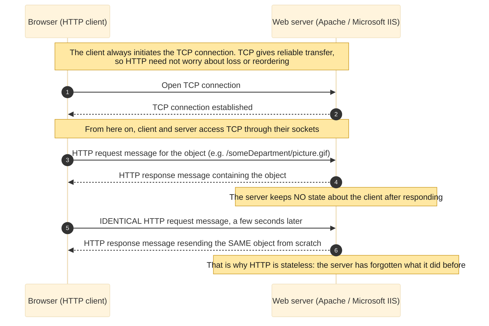

</Figure>

The second request can be observed served in full by requesting the same URL twice in one invocation.

```text
curl.exe -v http://example.com/ http://example.com/
```

The first GET is answered with a complete `200 OK` and the full body; the second GET is answered with another complete `200 OK` and the full
body again — a different `CF-RAY` identifier on each, here `a0d6e8a79b187af9-IAD` then `a0d6e8a7ebf07af9-IAD`. The server treats the repeat
as brand-new work. curl prints `* Reusing existing http: connection with host example.com` before the second request: the two GETs happen to
ride one open TCP connection, which is the persistence addressed next. Statelessness concerns the server's _memory_, not the number of
connections used.

<Warning>
  Statelessness and connection reuse are independent. This capture reused a single TCP connection for both GETs, so it should not be read as
  proof that two separate connections were opened — it is proof that each identical request is served in full, with no reference to the
  previous one.
</Warning>

## Non-persistent versus persistent connections and the RTT account

When a client and server communicate over TCP, the developer faces a real design decision: should each request/response pair travel on a
**separate** TCP connection, or should all of them share **one** connection? The first approach uses **non-persistent** connections, the
second **persistent** ones. HTTP can do both; in its default mode it uses persistent connections, but clients and servers can be configured
for non-persistent.

Consider the non-persistent case with the book's example: a page that is a base HTML file plus **10 JPEG images**, all 11 objects on the
same server, the base file at `http://www.someSchool.edu/someDepartment/home.index`.

1. The client initiates a TCP connection to the server on **port 80**; a socket is created on each side.
2. The client sends an HTTP request carrying the path `/someDepartment/home.index`.
3. The server retrieves the object from its storage (**RAM or disk**), encapsulates it in a response, and sends it.
4. The server tells TCP to **close** the connection — but TCP does not actually terminate until it is sure the client received the response
   intact.
5. The client receives the response, the connection ends, and the client parses the HTML and finds the **10 JPEG references**.
6. The first four steps repeat for each JPEG.

Each TCP connection carries **exactly one** request and one response, so the page generates **11 TCP connections**. The book is deliberately
vague about whether the 10 JPEGs come over serial or parallel connections: in their default modes most browsers open **5 to 10 parallel TCP
connections**, and the maximum can be set to one to force them serial. Parallel connections shorten the response time.

<Figure caption="Figure 3 — Non-persistent connections: 11 objects become 11 TCP connections, each with its own handshake, carrying a single request/response, then closed." zoomable>

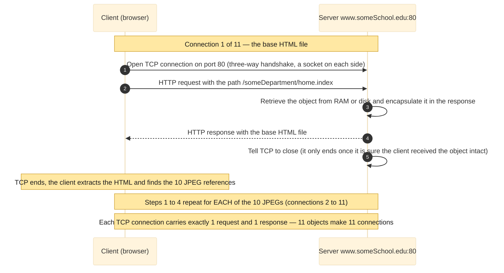

</Figure>

The cost of a single object is quantified by the **RTT** (round-trip time), the time for a small packet to travel from client to server and
back; it includes propagation, queuing and processing delays.

<Definition title="Round-trip time (RTT)">
  The time a small packet takes to go from client to server and back to the client, including propagation delays, queuing delays in
  intermediate routers and switches, and processing delays.
</Definition>

When the user clicks a hyperlink, the browser initiates a TCP connection, which involves a **three-way handshake**: the client sends a small
segment, the server acknowledges with a small segment, and the client acknowledges back. The first two parts take **one RTT**. The client
then sends the HTTP request combined with the third part of the handshake (the acknowledgment), and once the request reaches the server the
server sends the HTML file — that request/response consumes **another RTT**. Thus, approximately, the total response time is **two RTTs plus
the transmission time** of the HTML at the server.

<Figure caption="Figure 4 — The RTT account for one object: the first two parts of the handshake spend one RTT, the request and the arrival of the HTML spend one more, for a total of about 2 RTT plus the file's transmission time." zoomable>

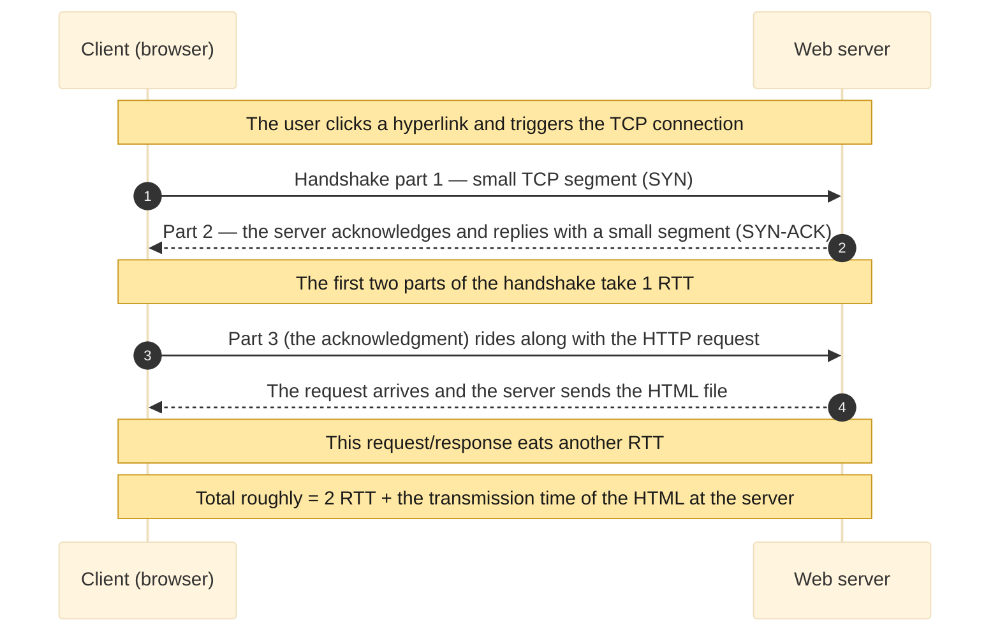

</Figure>

That account can be decomposed with curl's `-w` output, which prints timing checkpoints for a single fetch.

```text
curl.exe -w "dns: %{time_namelookup}s / tcp_connect: %{time_connect}s / ttfb: %{time_starttransfer}s / total: %{time_total}s" -o NUL -s http://example.com/
```

```text
dns:        0.003226s
tcp_connect:0.054317s
ttfb:       0.096145s
total:      0.096205s
remote_ip:  104.20.23.154
http_ver:   1.1
```

`tcp_connect` is the moment the **three-way handshake completes**; `ttfb` (time to first byte) is when the **first response byte** arrives.
The gap between them, here `0.096145 − 0.054317 ≈ 0.042 s`, is essentially the one RTT the request and its reply cost — the second of the
two RTTs in the account. The whole exchange finishes in `0.096205 s`, with `total` and `ttfb` almost equal because the object is tiny and
the transmission time is negligible. The numbers are raw curl checkpoints; the interpretation tying them to the handshake and the request
RTT is the reading added here.

Non-persistent connections have two shortcomings. First, a **brand-new connection** must be set up for each object, and each one forces TCP
buffers and variables to be allocated on both sides — a heavy load for a server fielding hundreds of clients at once. Second, each object
suffers a **two-RTT delay** (one to open the connection, one to request and receive it). With **HTTP 1.1 persistent connections**, the
server leaves the TCP connection **open** after responding, so subsequent requests and responses between the same client and server ride the
same connection — an entire page, even multiple pages on the same server. Those requests can be issued **back-to-back without waiting** for
pending replies (**pipelining**), and the server closes the connection after a configurable timeout. The default mode of HTTP is persistent
connections with pipelining.

<Note>
  That is the book's framing. In practice, HTTP/1.1 pipelining was never enabled by default in mainstream browsers and is rarely used today;
  HTTP/2's multiplexing — interleaving requests on one connection, which the figure notes — is the mechanism that actually replaced it. The
  connection reuse above (`keep-alive`) is the part of persistence that remains universal.
</Note>

<Figure caption="Figure 5 — A persistent connection with pipelining: a single TCP connection carries the base HTML file and the 10 JPEGs back-to-back, where the non-persistent case would have opened 11." zoomable>

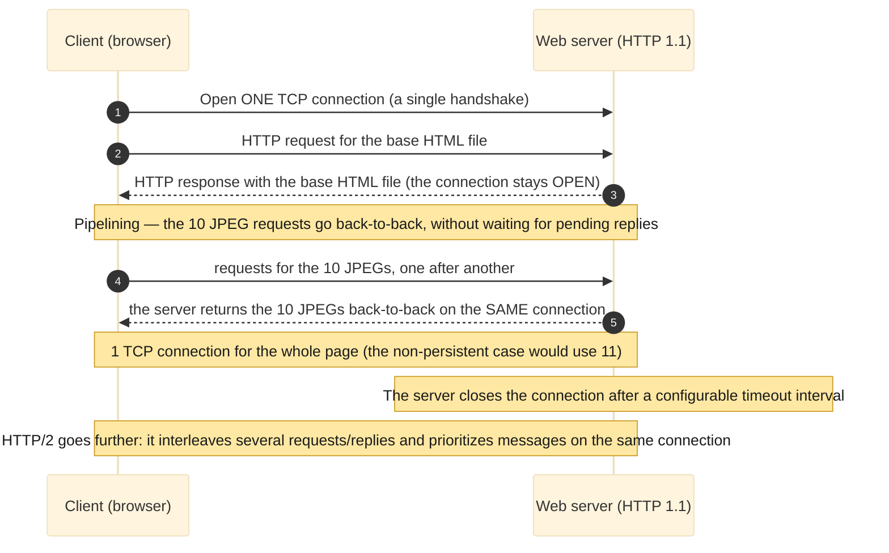

</Figure>

Persistence is observable in curl. The same two-GET command from the previous section reused one connection; the load-bearing line is the
second request's:

```text
* Reusing existing http: connection with host example.com
> GET / HTTP/1.1
> Host: example.com
< HTTP/1.1 200 OK
< Connection: keep-alive
```

The phrase `Reusing existing http: connection` is persistence in action, and the response header `Connection: keep-alive` is the server
agreeing to hold the connection open. The **non-persistent** behavior can be forced instead by sending `Connection: close`, the explicit
signal that the client does not want persistence.

```text
curl.exe -v -H "Connection: close" http://example.com/ http://example.com/
```

```text
* Established connection to example.com (104.20.23.154 port 80) from 192.168.40.166 port 57099
> GET / HTTP/1.1
> Host: example.com
> Connection: close
< HTTP/1.1 200 OK
< Connection: close
* shutting down connection #0
* Hostname example.com was found in DNS cache
*   Trying 104.20.23.154:80...
* Established connection to example.com (104.20.23.154 port 80) from 192.168.40.166 port 57100
> GET / HTTP/1.1
> Host: example.com
> Connection: close
< HTTP/1.1 200 OK
< Connection: close
* shutting down connection #1
```

The contrast is now sharp. The request carries `Connection: close` and the response echoes it; after the first object curl reports
`shutting down connection #0`, and the second request must open a **brand-new connection** — the local source port jumps from `57099` to
`57100`, two different TCP connections, exactly the non-persistent model.

## The HTTP message: request line, headers, methods, status codes

HTTP works only because client and server agree, byte for byte, on how a message is written — and the messages are plain **ASCII** (American
Standard Code for Information Interchange), so a literate human can read them. There are two kinds: **request** and **response**.

A request has three parts. The first line is the **request line**, with three fields: the **method**, the **URL**, and the HTTP **version**.
The lines after it are **header lines**. After the last header (and an extra carriage return and line feed) comes the **entity body**, empty
with `GET` and used with `POST`. The book's canonical request makes each header concrete:

```text
GET /somedir/page.html HTTP/1.1
Host: www.someschool.edu
Connection: close
User-agent: Mozilla/5.0
Accept-language: fr
```

`Host` names the host the object resides on (it is required by Web proxy caches, as the caching section shows); `Connection: close` asks the
server not to bother with persistence; `User-agent` declares the browser type (`Mozilla/5.0` is a Firefox), letting the server send
different versions of an object to different agents; and `Accept-language: fr` is one of several **content-negotiation** headers, here
requesting a French version if one exists. The method field can be **GET, POST, HEAD, PUT** or **DELETE**, and the great majority of
requests use **GET**, which fetches the object named in the URL.

<Figure caption="Figure 6 — Structure of the request message: a request line (method, URL, version) plus header lines plus an entity body, empty with GET and used with POST." zoomable>

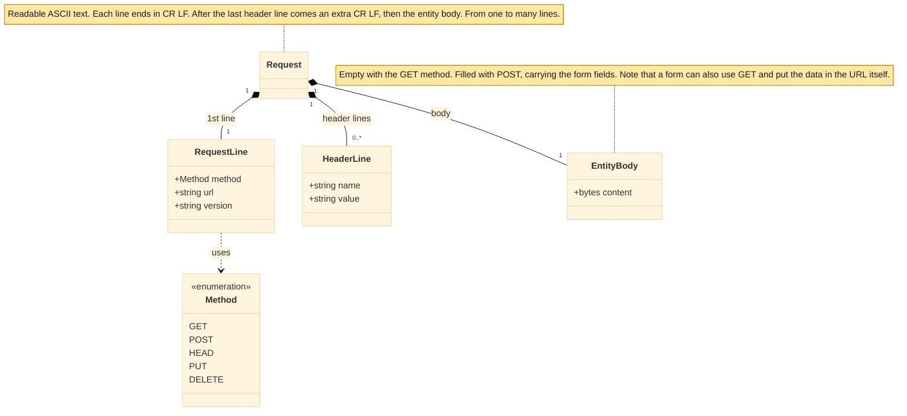

</Figure>

The other four methods each have a role. **POST** carries form fields in the entity body — though a form is not obliged to use POST; HTML
forms often use **GET** and append the data to the URL, as in `www.somesite.com/animalsearch?monkeys&bananas`. **HEAD** is like GET but the
server omits the object, which makes it well suited to debugging. **PUT** uploads an object to a path, and **DELETE** removes one.

A response has three sections too: a **status line** (version, status code, status message), header lines, and the entity body that carries
the object. The book's canonical response shows the key headers:

```text
HTTP/1.1 200 OK
Connection: close
Date: Tue, 18 Aug 2015 15:44:04 GMT
Server: Apache/2.2.3 (CentOS)
Last-Modified: Tue, 18 Aug 2015 15:11:03 GMT
Content-Length: 6821
Content-Type: text/html

(data data data data data ...)
```

`Date` is when the **response** was created and sent, not when the object was last changed; `Server` names the software (analogous to
`User-agent`); `Last-Modified` is when the **object** last changed and is critical for caching; `Content-Length` is the size in bytes; and
`Content-Type` gives the object's type — officially by this header, not by the file extension.

<Figure caption="Figure 7 — Structure of the response message: a status line (version, status code, phrase) plus header lines plus the entity body, which carries the requested object." zoomable>

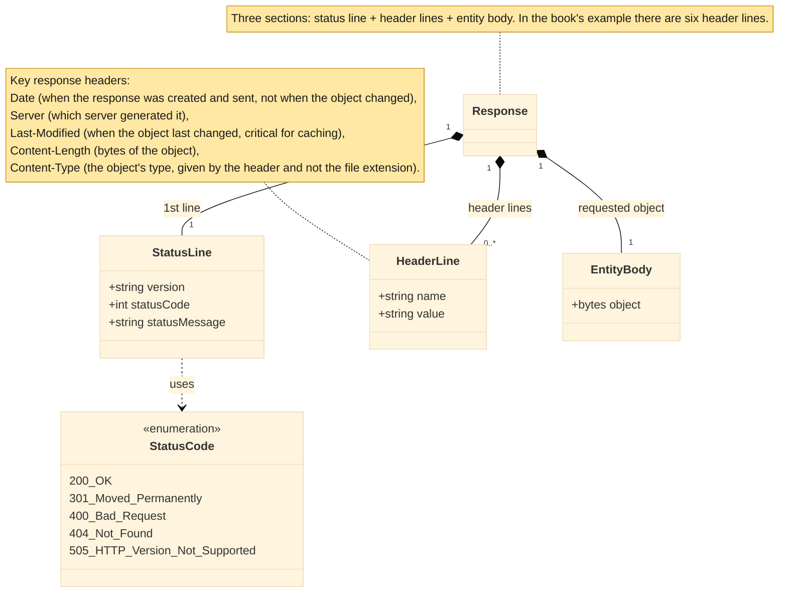

</Figure>

The status code and its phrase report the result. The common ones are `200 OK` (success, object returned), `301 Moved Permanently` (the new
URL is in the `Location` header and the client retrieves it automatically), `400 Bad Request` (a generic error the server could not
understand), `404 Not Found` (no such document), and `505 HTTP Version Not Supported`. The earlier `200 OK` from `example.com` already
showed the success case live; the others can be produced on demand. The **HEAD** method returns only the lines, with no object:

```text
curl.exe -I --http1.1 http://example.com/
```

```text
HTTP/1.1 200 OK
Date: Thu, 18 Jun 2026 02:36:55 GMT
Content-Type: text/html
Connection: keep-alive
Server: cloudflare
Last-Modified: Wed, 17 Jun 2026 20:54:39 GMT
Allow: GET, HEAD
Accept-Ranges: bytes
Age: 2044
cf-cache-status: HIT
CF-RAY: a0d6e8c03ad32039-IAD
```

The status line and headers are all present, and the entity body is absent — exactly what the book describes. A **POST** carries an entity
body that a GET does not. Sending the book's own `monkeys` and `bananas` form fields:

```text
curl.exe -v -d "monkeys=1&bananas=2" http://httpbin.org/post
```

```text
> POST /post HTTP/1.1
> Host: httpbin.org
> User-Agent: curl/8.19.0
> Accept: */*
> Content-Length: 19
> Content-Type: application/x-www-form-urlencoded
>
< HTTP/1.1 200 OK
< Content-Type: application/json
< Server: gunicorn/19.9.0
<
{
  "form": {
    "bananas": "2",
    "monkeys": "1"
  }
}
```

The request announces `Content-Length: 19` and `Content-Type: application/x-www-form-urlencoded` and ships the 19 bytes of the body; the
test server echoes the parsed form back. The `301 Moved Permanently` status code likewise arises naturally — it is what the book's own
interactive-problems server, `gaia.cs.umass.edu`, returns today on plain HTTP:

```text
curl.exe -v http://gaia.cs.umass.edu/kurose_ross/interactive/index.php
```

```text
> GET /kurose_ross/interactive/index.php HTTP/1.1
> Host: gaia.cs.umass.edu
< HTTP/1.1 301 Moved Permanently
< Server: Apache/2.4.62 (AlmaLinux) OpenSSL/3.5.5 mod_fcgid/2.3.9 mod_perl/2.0.12 Perl/v5.32.1
< Location: https://gaia.cs.umass.edu//kurose_ross/interactive/index.php
< Content-Type: text/html; charset=iso-8859-1
```

The `Location` header carries the new URL — here the HTTPS version of the same path — which the client follows automatically. And
`404 Not Found` follows from a single request for an object that does not exist:

```text
curl.exe -sI http://example.com/this-does-not-exist
```

```text
HTTP/1.1 404 Not Found
Date: Thu, 18 Jun 2026 02:36:59 GMT
Content-Type: text/html
Connection: keep-alive
Server: cloudflare
```

Because the messages are ASCII, the book recommends a hands-on exercise: opening a raw TCP connection and typing a request by hand.

<Figure caption="Figure 8 — The book's raw-conversation exercise: open a bare TCP connection to port 80, type a GET by hand, and read back the status line, headers and HTML; today the same host answers 301 and the conversation moves to TLS on port 443." zoomable>

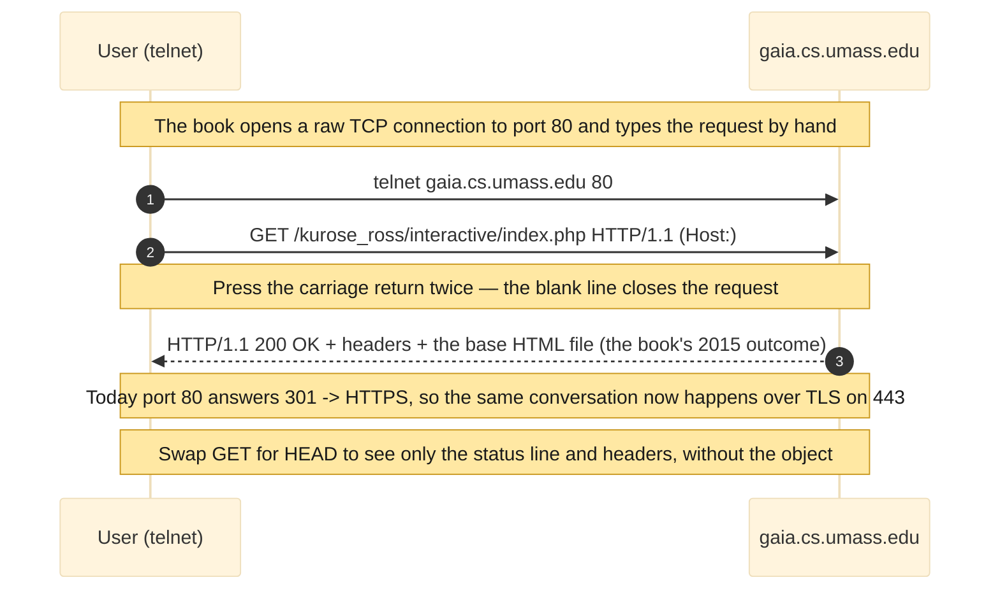

</Figure>

<Warning>
  The book's instruction is `telnet gaia.cs.umass.edu 80`, followed by a one-line `GET` and `Host`, with the return key pressed twice. On
  Windows the Telnet Client now ships disabled, and the host answers `301 Moved Permanently` on port 80 regardless, so the modern equivalent
  is the `curl -v` above: it makes the same raw conversation observable, and the `301` it returns is the very redirect to HTTPS that pushed
  the exercise onto TLS and port 443. Substituting `HEAD` for `GET` (curl's `-I`) yields only the lines.
</Warning>

Which header lines a browser includes depends on its type and version, the user's configuration (such as preferred language), and whether it
holds a cached copy of the object; servers vary by product, version and configuration in the same way. Only a small fraction of the headers
the specification defines has been covered here — and a few more appear in the discussion of caching.

## Cookies: four components and a real Set-Cookie cycle

Statelessness simplifies the server, but a site often **needs to identify** a user — to restrict access or to serve content by identity. An
online store, for example, must remember a user's cart across dozens of pages even though every request arrives independently. HTTP
reconciles the two with **cookies**, defined in **RFC 6265** [@RFC6265], and most major commercial sites use them.

Cookie technology has **four components**: (1) a `Set-cookie` header in the **response**; (2) a `Cookie` header in the **request**; (3) a
**cookie file** on the user's machine, managed by the browser; and (4) a **back-end database** at the site. Two of the four are simply
additional HTTP headers; the other two are the memory kept at each end.

The book's walkthrough proceeds as follows. Susan, who always uses Internet Explorer from her home PC, contacts Amazon for the first time
(she had previously visited eBay). Amazon creates a unique identification number and a database entry indexed by it, and responds with
`Set-cookie: 1678`. Her browser appends a line — the server's hostname and the number — to its cookie file, which already had an eBay entry.
From then on, every request to Amazon carries `Cookie: 1678`, so Amazon can track which pages user 1678 visited, in what order and at what
times. That powers the shopping cart and recommendations, and if Susan registers (name, e-mail, address, card) the database ties her name to
number 1678 — the basis of one-click shopping. The protocol stays stateless underneath; the "state" lives in the badge that travels back and
forth.

<Figure caption="Figure 9 — Keeping state with cookies: the Set-cookie in the response becomes a line in the cookie file, and the Cookie header reappears on every later request, exercising all four components." zoomable>

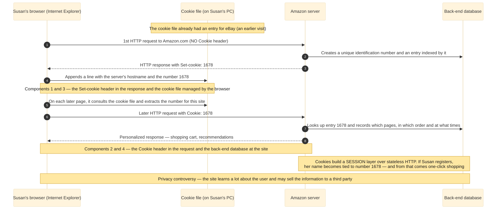

</Figure>

The whole cycle is reproducible with curl. First the server sends `Set-Cookie`, and `-c` writes curl's cookie file:

```text
curl.exe -v -c jar.txt "http://httpbin.org/cookies/set?sessionid=1678"
```

```text
> GET /cookies/set?sessionid=1678 HTTP/1.1
> Host: httpbin.org
< HTTP/1.1 302 FOUND
< Server: gunicorn/19.9.0
< Location: /cookies
* Added cookie sessionid="1678" for domain httpbin.org, path /, expire 0
< Set-Cookie: sessionid=1678; Path=/
```

The test server uses the named `sessionid=1678` where the book wrote the bare `1678`, but the pattern is exactly Susan's. The cookie file
curl wrote is the book's "cookie file" component, in the Netscape format, carrying the **hostname** and the **identifier**:

```text
# Netscape HTTP Cookie File
# https://curl.se/docs/http-cookies.html
# This file was generated by libcurl! Edit at your own risk.

httpbin.org	FALSE	/	FALSE	0	sessionid	1678
```

On the next request, `-b` reads that file back, so the client puts the `Cookie` header on the wire and the server recognizes the identifier:

```text
curl.exe -v -b jar.txt http://httpbin.org/cookies
```

```text
> GET /cookies HTTP/1.1
> Host: httpbin.org
> Cookie: sessionid=1678
< HTTP/1.1 200 OK
<
{
  "cookies": {
    "sessionid": "1678"
  }
}
```

That is Figure 9 in miniature: `Set-Cookie` in the response, a line in the cookie file, `Cookie` on the next request, the server recognizing
the client. The `302`, the Netscape jar format and the `-c`/`-b` flags are curl's concrete machinery, not the book's text, but they map
cleanly onto its four components. Cookies thus create a user-session layer over stateless HTTP — the same mechanism behind staying logged
into a webmail account. They are also controversial: combined with account information, a site can learn a great deal about a user and
potentially sell it to a third party.

## Web caching, the numeric example, CDNs, and the conditional GET

Consider a whole university browsing through one shared link to the Internet. If every request has to cross that narrow access link to an
origin server on the far side of the world, the link becomes everyone's bottleneck. The remedy mirrors a neighborhood library keeping the
most-requested books on hand: place a copy of what was already fetched close to whoever requests it.

<Definition title="Web cache (proxy server)">
  A network entity that satisfies HTTP requests on behalf of an origin server. It has its own disk storage, keeps copies of recently
  requested objects, and is configured so that all of a browser's requests are directed to it first.
</Definition>

The flow for `http://www.someschool.edu/campus.gif` is short. The browser opens a TCP connection to the cache and requests the object. On a
**hit**, the cache returns its local copy. On a **miss**, the cache opens a TCP connection to the **origin server**, fetches the object,
**stores a copy**, and returns it to the browser over the connection that is already open. The key observation is that a cache is **both a
server and a client**: a server to the browser, a client to the origin.

<Figure caption="Figure 10 — A Web cache (proxy): on a hit it returns the local copy, while on a miss it opens a TCP connection to the origin, fetches, stores and returns — acting as server and client at once." zoomable>

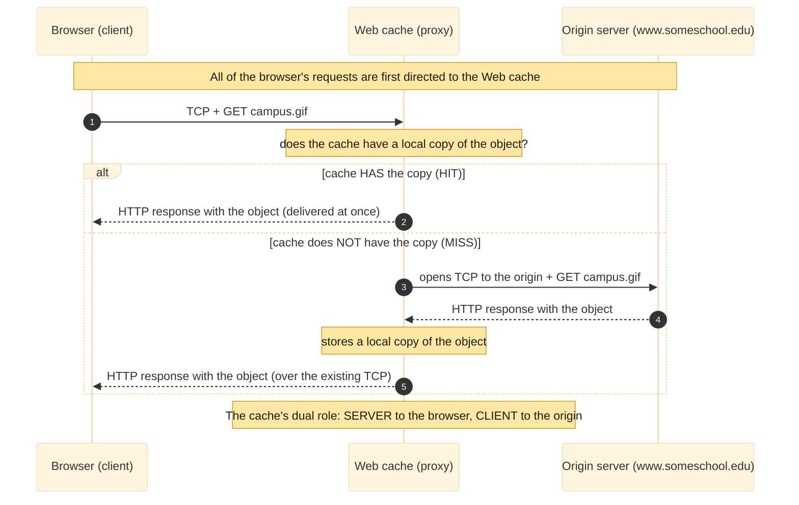

</Figure>

A cache is usually bought and installed by an **ISP** (Internet Service Provider) — a university on its campus, or a residential ISP like
Comcast in its network — for two reasons: it **reduces response time** (the link to the cache is fast and local) and it **reduces traffic on
the access link** to the Internet, deferring expensive upgrades and easing congestion for everyone.

The book's numbers make the case. Consider an institutional **LAN** (Local Area Network) at 100 Mbps connected to the Internet by a **15
Mbps** access link; average object size **1 Mbit**; **15 requests per second**; and a round-trip "Internet delay" of **2 seconds** to fetch
from the origin servers. Traffic intensity is `request rate × object size ÷ link rate`. On the LAN that is `(15)(1)/100 = 0.15`, which adds
at most tens of milliseconds — negligible. On the access link it is `(15)(1)/15 = 1.0`, and as intensity approaches 1 the delay grows
without bound, pushing the average response time to the **order of minutes** — unacceptable.

There are two ways out. **Solution 1** is to upgrade the access link from 15 to 100 Mbps, which drops its intensity to 0.15 and the total
time to about 2 seconds — but the upgrade is **costly**. **Solution 2** is to install a Web cache and leave the link unchanged. Hit rates in
practice run **0.2 to 0.7**; assume **0.4**. Then 40% of requests are served from the local cache in about 10 ms, and only the remaining 60%
cross the access link, which drops its intensity from 1.0 to **0.6** and its delay back to the negligible range. The average delay becomes:

```text
0.4 × (0.01 s) + 0.6 × (2.01 s) = 1.21 s
```

just over **1.2 seconds** — even better than the costly upgrade, and without touching the link. The cache itself is cheap, since much cache
software is public-domain and runs on inexpensive PCs.

<Figure caption="Figure 11 — The access-link bottleneck: without a cache the access intensity is 1.0 and the delay runs to minutes, while a cache with hit rate 0.4 drops the intensity to 0.6 and the average delay to about 1.2 s, with no link upgrade." zoomable>

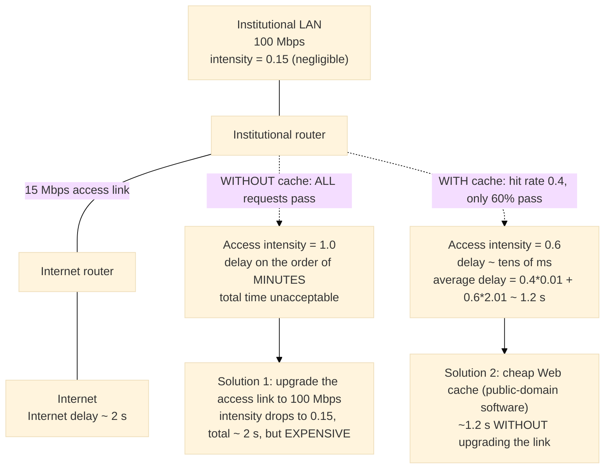

</Figure>

Scaled up, this idea becomes a **CDN** (Content Distribution Network): a company installs many geographically distributed caches across the
Internet, localizing much of the traffic. There are **shared** CDNs (Akamai, Limelight) and **dedicated** ones (Google, Netflix). The cache
ceases to be a single box on a campus and becomes a planetary network of copies.

Caching introduces one new problem: a cached copy may be **stale** — the object on the origin server may have changed since it was cached.
HTTP solves it with the **conditional GET**.

<Definition title="Conditional GET">
  An HTTP request that uses the `GET` method and includes an `If-Modified-Since` header. It tells the server to send the object only if it
  has changed since the given date.
</Definition>

The mechanism rests on the `Last-Modified` header from the message section. When the cache first fetches `/fruit/kiwi.gif`, it stores the
object **and** its `Last-Modified` date (say `Wed, 9 Sep 2015 09:23:24`). A week later, asked for the same object, the cache runs an
up-to-date check by issuing a conditional GET whose `If-modified-since` value is **exactly** that `Last-Modified` date. If the object has
not changed, the server replies `304 Not Modified` with an **empty body**, and the cache serves its own copy — no object travels twice.

<Figure caption="Figure 12 — The conditional GET: the cache stores the object together with its Last-Modified date, and a week later sends If-Modified-Since; if nothing changed, the server returns 304 Not Modified with no body, saving bandwidth." zoomable>

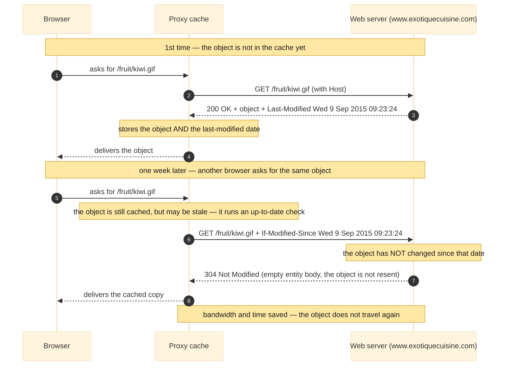

</Figure>

The pattern reproduces exactly. First an object's `Last-Modified` is captured with a HEAD, then sent back as `If-Modified-Since`:

```text
curl.exe -sI http://example.com/
```

```text
HTTP/1.1 200 OK
Server: cloudflare
Last-Modified: Wed, 17 Jun 2026 20:54:39 GMT
```

```text
curl.exe -v -H "If-Modified-Since: Wed, 17 Jun 2026 20:54:39 GMT" http://example.com/
```

```text
> GET / HTTP/1.1
> Host: example.com
> If-Modified-Since: Wed, 17 Jun 2026 20:54:39 GMT
>
< HTTP/1.1 304 Not Modified
< Server: cloudflare
< Last-Modified: Wed, 17 Jun 2026 20:54:39 GMT
< etag: "6a33098f-22f"
```

The `If-Modified-Since` value equals the `Last-Modified` from a moment earlier, and the server answers `304 Not Modified` with no body —
precisely the book's exchange. It works against a real Apache server too. `info.cern.ch`, home of the first website, has served the same
file with a stable `Last-Modified` since 2014:

```text
curl.exe -sI http://info.cern.ch/
```

```text
HTTP/1.1 200 OK
Server: Apache
Last-Modified: Wed, 05 Feb 2014 16:00:31 GMT
ETag: "286-4f1aadb3105c0"
Content-Length: 646
```

```text
curl.exe -v -H "If-Modified-Since: Wed, 05 Feb 2014 16:00:31 GMT" http://info.cern.ch/
```

```text
> GET / HTTP/1.1
> Host: info.cern.ch
> If-Modified-Since: Wed, 05 Feb 2014 16:00:31 GMT
>
< HTTP/1.1 304 Not Modified
< Server: Apache
< Last-Modified: Wed, 05 Feb 2014 16:00:31 GMT
< ETag: "286-4f1aadb3105c0"
```

The Apache server returns the same `304 Not Modified` by date, faithful to the K&R example down to the `Server: Apache` line.

<Warning>
  Note the `ETag` header above. A second form of conditional request, `If-None-Match`, validates against that opaque tag instead of a date
  and also yields `304`. It is a useful real-world extension — but it is **not** part of the K&R 2.2.5 mechanism, which uses only
  `If-Modified-Since` against `Last-Modified`. `ETag`/`If-None-Match` belongs to modern HTTP, not to the textbook's conditional GET.
</Warning>

## HTTP today: HTTPS, the 2022 RFC revision, and HTTP/2 and /3

The textbook is faithful to the HTTP of its era, and it is worth closing the gap to the standards as they stand now — all of it verifiable
against the RFC record. The book states that HTTP "is defined in [RFC 1945] and [RFC 2616]." That is historically exact: **RFC 1945**
[@RFC1945] is HTTP/1.0 (1996), and **RFC 2616** [@RFC2616] is the classic single-document HTTP/1.1 (1999). Two cautions follow. RFC 1945 is
only an **Informational** document, not a standards-track standard; and RFC 2616 is now **obsolete** — it was superseded in 2014 and then,
in 2022, replaced by a new core.

<Note>
  The 2022 revision splits HTTP into version-independent semantics and per-version messaging. **RFC 9110, HTTP Semantics** [@RFC9110], an
  Internet Standard (STD 97), defines the methods, status codes, header fields, content negotiation and conditional requests shared by every
  version. **RFC 9112, HTTP/1.1** [@RFC9112], an Internet Standard (STD 99), defines the HTTP/1.1 message syntax and connection management.
  So current HTTP/1.1 is RFC 9112 plus RFC 9110, not RFC 2616.
</Note>

The higher versions follow the same split. **HTTP/2**, which the book introduces as RFC 7540 [@RFC7540] — interleaving and prioritizing
messages on one connection — is now defined by **RFC 9113** [@RFC9113], which obsoletes RFC 7540 and reuses the RFC 9110 semantics.
**HTTP/3** is **RFC 9114** [@RFC9114]: the same HTTP semantics carried over the QUIC transport instead of TCP, with TLS 1.3 built in.
Cookies are the one piece that needs no caveat — **RFC 6265** [@RFC6265] is current.

<Warning>
  The maturity levels must be stated precisely: only **RFC 9110** (STD 97) and **RFC 9112** (STD 99) are full Internet Standards. **RFC
  9113** (HTTP/2) and **RFC 9114** (HTTP/3) are Proposed Standards; **RFC 1945** is Informational; **RFC 6265** is a Proposed Standard; and
  **RFC 2616** was a Draft Standard and is obsolete. RFC 2616 and RFC 7540 should be cited as what the textbook references, but never as the
  current specifications.
</Warning>

This also explains a small surprise from the lab. The book's raw-conversation exercise targeted plain HTTP on port 80, but
`gaia.cs.umass.edu` answered `301 Moved Permanently` with a `Location` pointing at `https://...`. Plaintext port 80 is now, for most sites,
little more than a redirect to **HTTPS**, the same HTTP semantics carried inside a **TLS** (Transport Layer Security) tunnel. The protocol
described above is unchanged; today it usually travels wrapped.

## Next steps

This concludes the examination of HTTP, the first application-layer protocol studied in detail. The format of HTTP messages and the actions
a client and server take to exchange them have been presented, alongside a slice of the Web's application infrastructure — caches, cookies
and back-end databases — all tied back to the protocol. The lab stopped where the curl conversation already exposes everything the wire
carries.

Several extensions remain. The book defers the **quantitative** comparison of non-persistent and persistent connections to the homework
problems of Chapters 2 and 3, and develops **CDNs** in Section 2.6. On the practical side, a natural extension is packet-level inspection
with **Wireshark** against a clean plaintext target — `info.cern.ch` still serves over port 80 — filtering on `http` to observe the request
line, the headers and the three-way handshake on the wire, with `Follow HTTP Stream` exposing the request and response side by side. From
there, capturing a real **HTTP/2** or **HTTP/3** session bridges to the modern stack laid out in the previous section.

## References
