import { Definition, Note, Warning, Figure, Sidenote } from '../../../components/mdx';

Toda recuperação de uma página web envolve uma breve troca textual que permanece invisível ao usuário. A máquina local abre uma conexão e
emite um pequeno número de linhas em ASCII puro, e um servidor responde da mesma forma, com a página solicitada anexada. Essa troca é
governada pelo **HTTP** (HyperText Transfer Protocol), o protocolo de camada de aplicação no coração da Web. Este artigo examina essa troca
linha por linha. A teoria segue os fundamentos de Kurose e Ross [@KuroseRoss2016], e cada conceito é apresentado ao lado do comando que o
torna observável, com a saída **real** capturada numa máquina Windows usando o `curl`. As saídas foram coletadas em 17 de junho de 2026 com
o `curl.exe` 8.19.0 e estão reproduzidas tal como deixaram o terminal, recortadas do medidor de progresso do curl e, nos blocos mais longos,
de headers repetidos de praxe — preservando as linhas que importam.

<nav class="paper-toc" aria-label="Sumário">

**Sumário**

- [O problema: de um clique a uma conversa](#o-problema-de-um-clique-a-uma-conversa)
- [HTTP sobre TCP e o vocabulário de página, objeto e URL](#http-sobre-tcp-e-o-vocabulário-de-página-objeto-e-url)
- [Sem estado e cliente-servidor](#sem-estado-e-cliente-servidor)
- [Conexões não-persistentes versus persistentes e a conta do RTT](#conexões-não-persistentes-versus-persistentes-e-a-conta-do-rtt)
- [A mensagem HTTP: linha de requisição, headers, métodos e status codes](#a-mensagem-http-linha-de-requisição-headers-métodos-e-status-codes)
- [Cookies: quatro componentes e um ciclo Set-Cookie real](#cookies-quatro-componentes-e-um-ciclo-set-cookie-real)
- [Web caching, o exemplo numérico, CDNs e o conditional GET](#web-caching-o-exemplo-numérico-cdns-e-o-conditional-get)
- [HTTP hoje: HTTPS, a revisão RFC de 2022 e o HTTP/2 e /3](#http-hoje-https-a-revisão-rfc-de-2022-e-o-http2-e-3)
- [Próximos passos](#próximos-passos)

</nav>

## O problema: de um clique a uma conversa

Até o início dos anos 1990, a Internet era principalmente uma ferramenta de pesquisadores e estudantes universitários: login remoto,
transferência de arquivos, notícias e e-mail. Útil, porém praticamente desconhecida do grande público. O que mudou tudo foi a **World Wide
Web**, que chegou no início dos anos 1990 e foi a primeira aplicação da Internet a capturar a atenção do público em geral. Seu principal
atrativo é que a Web opera **on demand** (sob demanda): o conteúdo é entregue quando é solicitado, ao contrário do rádio e da televisão por
difusão, que exigem sintonizar no horário em que o provedor de conteúdo decide.

No centro de tudo isso está um único protocolo de camada de aplicação, e é ele que este artigo disseca. O HTTP é implementado em dois
programas, um **cliente** e um **servidor**, rodando em sistemas finais distintos, que se comunicam trocando **mensagens HTTP**. O protocolo
define duas coisas: a **estrutura** dessas mensagens e **como** o cliente e o servidor as trocam. Tudo o que vem abaixo é um meio de tornar
essas duas definições observáveis.

<Note>
  Os comandos foram rodados como `curl.exe` no Windows. No PowerShell, o nome cru `curl` é um alias para o `Invoke-WebRequest`, uma
  ferramenta diferente que devolve objetos em vez dos bytes crus no fio, então o laboratório usa o `curl.exe` explicitamente para obter a
  conversa HTTP de verdade. Os blocos abaixo mantêm o trace de conexão do curl (as linhas `*`) e as linhas de requisição (`>`) e de resposta
  (`<`), descartando o medidor de progresso e, nas trocas mais longas, headers repetidos de praxe.
</Note>

## HTTP sobre TCP e o vocabulário de página, objeto e URL

Algum vocabulário antecede o protocolo. Uma **página web** (também chamada de **documento**) é formada por **objetos**. Um objeto é
simplesmente um arquivo — um arquivo **HTML** (HyperText Markup Language), uma imagem JPEG, um applet Java, um clipe de vídeo — endereçável
por uma única **URL** (Uniform Resource Locator). A maioria das páginas é um **arquivo HTML base** mais vários objetos referenciados: uma
página com texto HTML e cinco imagens JPEG tem **seis objetos**, o arquivo base mais as cinco imagens, e o arquivo base referencia os outros
pelas URLs deles.

<Definition title="Objeto">
  Um arquivo endereçável por uma única URL. Uma URL tem dois componentes, o **hostname** do servidor que hospeda o objeto e o **path name**
  (caminho) do objeto. Em `http://www.someSchool.edu/someDepartment/picture.gif`, o hostname é `www.someSchool.edu` e o path é
  `/someDepartment/picture.gif`.
</Definition>

Como os navegadores (Internet Explorer, Firefox) implementam o lado **cliente** do HTTP, no contexto da Web os termos _navegador_ e
_cliente_ são usados como sinônimos. Os servidores Web, que implementam o lado **servidor** e hospedam os objetos, são programas como o
**Apache** e o **Microsoft Internet Information Server**.

<Figure caption="Figura 1 — Anatomia de uma página web: uma página resolve para um arquivo HTML base mais objetos referenciados, cada um endereçado pela sua própria URL de hostname mais path name." zoomable>

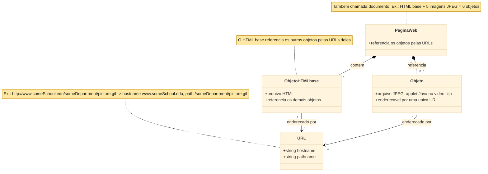

</Figure>

A escolha de projeto decisiva é o transporte. O HTTP usa o **TCP** (Transmission Control Protocol) como transporte subjacente, não o **UDP**
(User Datagram Protocol). O cliente HTTP **inicia primeiro** uma conexão TCP com o servidor, e uma vez estabelecida ambos os lados acessam o
TCP pelas suas interfaces de **socket**. O cliente envia as request messages para o seu socket e recebe as response messages dele; o
servidor faz o espelho. O TCP dá ao HTTP um serviço de transferência **confiável**, então cada request e response chega **intacta** — e é aí
que aparece a grande vantagem da arquitetura em camadas: o HTTP não precisa se preocupar com perda ou reordenação de dados, porque isso é
trabalho do TCP.

Toda a troca é observável com um único comando. O `curl -v` abre a conexão TCP, envia a requisição e imprime cada linha que cruza o fio. Na
invocação a seguir, ele solicita ao `example.com` o objeto raiz, posando de navegador Firefox com o `-A`.

```text
curl.exe -v --http1.1 -A "Mozilla/5.0" http://example.com/
```

```text
* Host example.com:80 was resolved.
* IPv6: (none)
* IPv4: 104.20.23.154, 172.66.147.243
*   Trying 104.20.23.154:80...
* Established connection to example.com (104.20.23.154 port 80) from 192.168.40.166 port 57087
* using HTTP/1.x
> GET / HTTP/1.1
> Host: example.com
> User-Agent: Mozilla/5.0
> Accept: */*
>
* Request completely sent off
< HTTP/1.1 200 OK
< Date: Thu, 18 Jun 2026 02:36:51 GMT
< Content-Type: text/html
< Transfer-Encoding: chunked
< Connection: keep-alive
< Server: cloudflare
< Last-Modified: Wed, 17 Jun 2026 20:54:39 GMT
< Allow: GET, HEAD
< Accept-Ranges: bytes
< Age: 2040
< cf-cache-status: HIT
< CF-RAY: a0d6e8a2e8c5bacc-IAD
<
* Connection #0 to host example.com:80 left intact
<!doctype html><html lang="en"><head><title>Example Domain</title>...</body></html>
```

O vocabulário inteiro está visível neste único trace. As linhas `*` são a narração do próprio curl: o nome `example.com` é resolvido a um
IP, e uma conexão TCP é **estabelecida na porta 80**, a porta padrão do HTTP. As linhas que começam com `>` são a **requisição** que o
cliente digitou no socket — uma request line `GET / HTTP/1.1` e alguns headers. As linhas que começam com `<` são a **resposta** que o
servidor devolveu — uma status line `HTTP/1.1 200 OK` e seus headers, seguidos do próprio objeto, o `<!doctype html>...` lá embaixo. A
conversa é texto puro sobre uma conexão TCP confiável, exatamente como a teoria prevê. Os campos dentro dela — os métodos, os status codes,
os headers — são o objeto do restante deste artigo.

## Sem estado e cliente-servidor

Uma propriedade dessa troca é facilmente despercebida porque nada a marca visivelmente: o servidor não guarda **estado** algum sobre o
cliente. Se um cliente solicita o mesmo objeto duas vezes num intervalo de poucos segundos, o servidor não indica que acabou de enviar esse
objeto; ele **reenvia** o objeto, tendo esquecido completamente a requisição anterior. Como um servidor HTTP não mantém informação alguma
sobre os clientes, o HTTP é um protocolo **stateless** (sem estado).

<Definition title="Protocolo stateless">
  Um protocolo cujo servidor não guarda informação sobre requisições passadas do cliente. Cada requisição é atendida por si só, como se o
  cliente nunca tivesse sido visto antes.
</Definition>

Isso se combina com a arquitetura **cliente-servidor** da Web: um servidor Web fica **sempre ligado** (always on), tem um **endereço IP
fixo** e atende requisições de potencialmente **milhões** de navegadores diferentes. O caráter stateless é precisamente o que torna isso
viável em escala — como o servidor não guarda estado por cliente, os engenheiros conseguem construir servidores de alto desempenho capazes
de tratar milhares de conexões TCP simultâneas. Quando um site genuinamente precisa reconhecer um usuário, ele constrói uma camada fina de
estado _por cima_ do HTTP stateless usando cookies, assunto de uma seção posterior.

<Figure caption="Figura 2 — O comportamento requisição-resposta do HTTP sobre TCP: o cliente sempre abre a conexão e o servidor não guarda memória entre as requisições, então uma segunda requisição idêntica é atendida do zero." zoomable>

```mermaid
---
config:
  theme: base
  themeVariables:
    noteBkgColor: '#FFE8A3'
    noteTextColor: '#1A1A1A'
    noteBorderColor: '#C9971C'
---
sequenceDiagram
    autonumber
    participant B as Navegador (cliente HTTP)
    participant S as Servidor Web (Apache / Microsoft IIS)

    Note over B,S: O cliente sempre inicia a conexão TCP. O TCP dá transferência confiável,<br/>então o HTTP não se preocupa com perda nem reordenação
    B->>S: Abrir conexão TCP
    S-->>B: Conexão TCP estabelecida
    Note over B,S: A partir daqui cliente e servidor acessam o TCP pelos sockets
    B->>S: HTTP request message para o objeto (ex.: /someDepartment/picture.gif)
    S-->>B: HTTP response message contendo o objeto
    Note over S: O servidor NÃO guarda nenhum estado do cliente após responder
    B->>S: HTTP request message IDÊNTICA, poucos segundos depois
    S-->>B: HTTP response message reenviando o MESMO objeto do zero
    Note over S: Por isso o HTTP é stateless: o servidor esqueceu o que fez antes
```

</Figure>

A segunda requisição pode ser observada atendida por inteiro solicitando a mesma URL duas vezes numa só invocação.

```text
curl.exe -v http://example.com/ http://example.com/
```

O primeiro GET é respondido com um `200 OK` completo e o corpo inteiro; o segundo GET é respondido com outro `200 OK` completo e o corpo
inteiro novamente — um identificador `CF-RAY` diferente em cada um, aqui `a0d6e8a79b187af9-IAD` e depois `a0d6e8a7ebf07af9-IAD`. O servidor
trata a repetição como trabalho inteiramente novo. O curl imprime `* Reusing existing http: connection with host example.com` antes da
segunda requisição: os dois GET, por acaso, vão numa mesma conexão TCP aberta, que é a persistência tratada a seguir. O caráter stateless
diz respeito à _memória_ do servidor, não ao número de conexões utilizadas.

<Warning>
  Stateless e reaproveitamento de conexão são independentes. Esta captura reusou uma única conexão TCP para os dois GET, de modo que não
  deve ser lida como prova de que duas conexões separadas foram abertas — ela é prova de que cada requisição idêntica é atendida por
  inteiro, sem referência à anterior.
</Warning>

## Conexões não-persistentes versus persistentes e a conta do RTT

Quando um cliente e um servidor se comunicam sobre TCP, o desenvolvedor enfrenta uma decisão de projeto real: cada par request/response deve
viajar numa conexão TCP **separada**, ou todos devem compartilhar **uma** conexão? A primeira abordagem usa conexões **não-persistentes**, a
segunda usa conexões **persistentes**. O HTTP admite as duas; no seu modo padrão usa conexões persistentes, mas clientes e servidores podem
ser configurados para não-persistentes.

Considere-se o caso não-persistente com o exemplo do livro: uma página que é um arquivo HTML base mais **10 imagens JPEG**, todos os 11
objetos no mesmo servidor, o arquivo base em `http://www.someSchool.edu/someDepartment/home.index`.

1. O cliente inicia uma conexão TCP ao servidor na **porta 80**; um socket é criado em cada lado.
2. O cliente manda uma HTTP request carregando o path `/someDepartment/home.index`.
3. O servidor recupera o objeto do seu armazenamento (**RAM ou disco**), encapsula numa response e a envia.
4. O servidor manda o TCP **fechar** a conexão — mas o TCP não encerra de fato até ter certeza de que o cliente recebeu a resposta intacta.
5. O cliente recebe a resposta, a conexão termina, e o cliente examina o HTML e acha as **10 referências JPEG**.
6. Os quatro primeiros passos se repetem para cada JPEG.

Cada conexão TCP carrega **exatamente uma** request e uma response, então a página gera **11 conexões TCP**. O livro é deliberadamente vago
sobre se os 10 JPEG vêm por conexões seriais ou paralelas: nos seus modos padrão, a maioria dos navegadores abre **5 a 10 conexões TCP
paralelas**, e o máximo pode ser ajustado para um, forçando-as a serem seriais. Conexões paralelas encurtam o tempo de resposta.

<Figure caption="Figura 3 — Conexões não-persistentes: 11 objetos viram 11 conexões TCP, cada uma com seu próprio handshake, carregando um único request/response, e então fechada." zoomable>

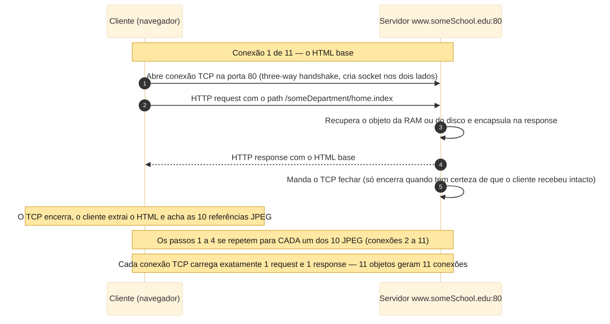

</Figure>

O custo de um único objeto é quantificado pelo **RTT** (round-trip time), o tempo de um pacote pequeno ir do cliente ao servidor e voltar;
ele inclui atrasos de propagação, de fila e de processamento.

<Definition title="Round-trip time (RTT)">
  O tempo que um pacote pequeno leva para ir do cliente ao servidor e voltar ao cliente, incluindo atrasos de propagação, atrasos de fila em
  roteadores e switches intermediários, e atrasos de processamento.
</Definition>

Quando o usuário clica num hyperlink, o navegador inicia uma conexão TCP, o que envolve um **three-way handshake**: o cliente envia um
segmento pequeno, o servidor confirma com um segmento pequeno, e o cliente confirma de volta. As duas primeiras partes levam **um RTT**. O
cliente então envia a HTTP request combinada com a terceira parte do handshake (o acknowledgment), e assim que a request chega ao servidor
ele envia o arquivo HTML — esse request/response consome **mais um RTT**. Assim, aproximadamente, o tempo total de resposta é **dois RTT
mais o tempo de transmissão** do HTML no servidor.

<Figure caption="Figura 4 — A conta de RTT por objeto: as duas primeiras partes do handshake gastam um RTT, a request e a chegada do HTML gastam mais um, para um total de cerca de 2 RTT mais o tempo de transmissão do arquivo." zoomable>

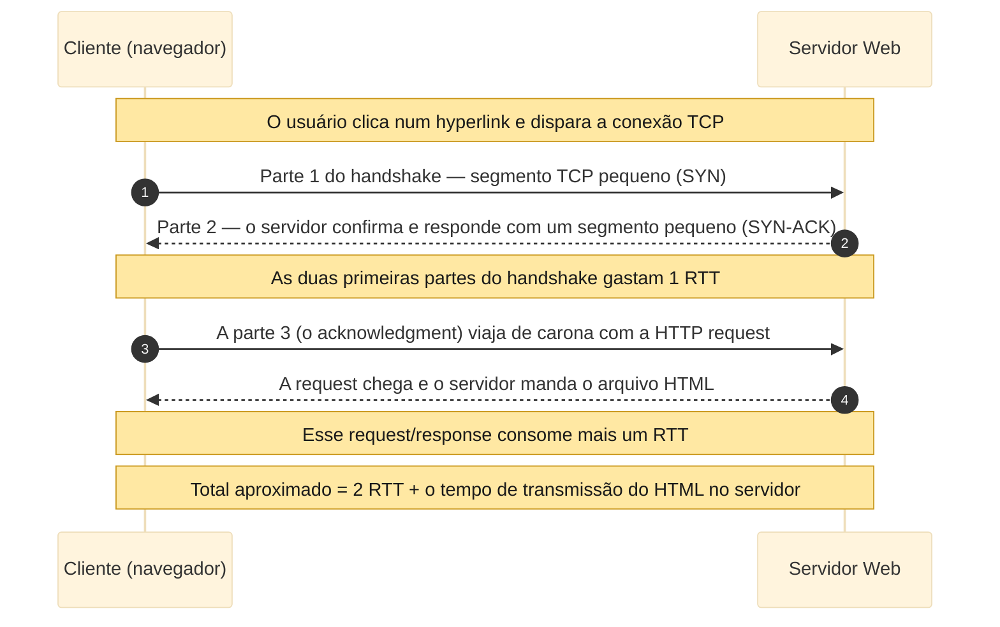

</Figure>

Essa conta pode ser decomposta com a saída `-w` do curl, que imprime checkpoints de tempo para um único fetch.

```text
curl.exe -w "dns: %{time_namelookup}s / tcp_connect: %{time_connect}s / ttfb: %{time_starttransfer}s / total: %{time_total}s" -o NUL -s http://example.com/
```

```text
dns:        0.003226s
tcp_connect:0.054317s
ttfb:       0.096145s
total:      0.096205s
remote_ip:  104.20.23.154
http_ver:   1.1
```

O `tcp_connect` é o momento em que o **three-way handshake se completa**; o `ttfb` (time to first byte) é quando o **primeiro byte da
resposta** chega. A diferença entre eles, aqui `0.096145 − 0.054317 ≈ 0.042 s`, é essencialmente o um RTT que a request e a resposta
custaram — o segundo dos dois RTT da conta. A troca inteira termina em `0.096205 s`, com `total` e `ttfb` quase iguais porque o objeto é
minúsculo e o tempo de transmissão é desprezível. Os números são checkpoints crus do curl; a interpretação que os amarra ao handshake e ao
RTT da request é a leitura aqui acrescentada.

As conexões não-persistentes têm duas desvantagens. Primeira, uma conexão **inteiramente nova** precisa ser estabelecida para cada objeto, e
cada uma força buffers e variáveis TCP a serem alocados nos dois lados — uma carga pesada para um servidor que atende centenas de clientes
de uma vez. Segunda, cada objeto sofre um atraso de **dois RTT** (um para abrir a conexão, um para solicitar e receber). Com as **conexões
persistentes do HTTP 1.1**, o servidor deixa a conexão TCP **aberta** depois de responder, então requests e responses seguintes entre o
mesmo cliente e servidor vão pela mesma conexão — uma página inteira, ou até várias páginas do mesmo servidor. Esses requests podem ser
emitidos **back-to-back, sem esperar** respostas pendentes (**pipelining**), e o servidor fecha a conexão após um timeout configurável. O
modo padrão do HTTP é conexões persistentes com pipelining.

<Note>
  Essa é a moldura do livro. Na prática, o pipelining do HTTP 1.1 nunca foi habilitado por padrão nos navegadores populares e hoje é
  raramente usado; o multiplexing do HTTP/2 — que intercala requests numa só conexão, como a figura aponta — é o mecanismo que de fato o
  substituiu. O reaproveitamento de conexão acima (`keep-alive`) é a parte da persistência que continua universal.
</Note>

<Figure caption="Figura 5 — Uma conexão persistente com pipelining: uma única conexão TCP carrega o arquivo HTML base e os 10 JPEG back-to-back, onde o caso não-persistente teria aberto 11." zoomable>

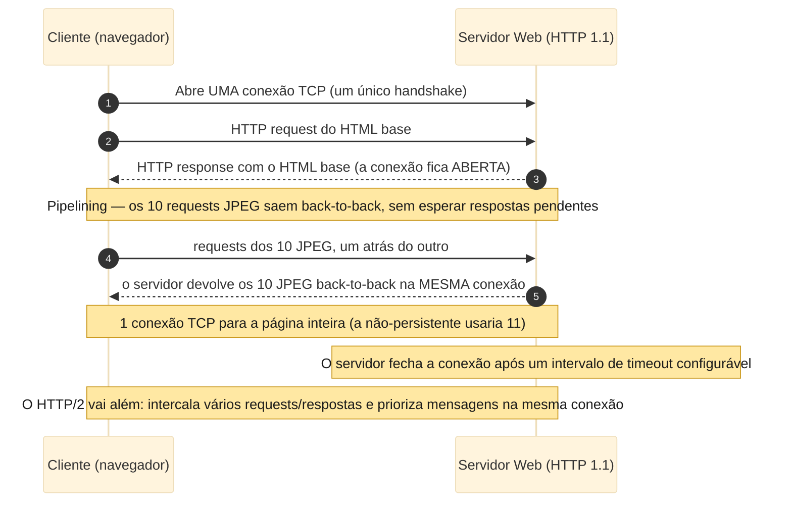

</Figure>

A persistência é observável no curl. O mesmo comando de dois GET da seção anterior reusou uma conexão; a linha que sustenta tudo é a da
segunda requisição:

```text
* Reusing existing http: connection with host example.com
> GET / HTTP/1.1
> Host: example.com
< HTTP/1.1 200 OK
< Connection: keep-alive
```

A frase `Reusing existing http: connection` é a persistência em ação, e o header de resposta `Connection: keep-alive` é o servidor
concordando em manter a conexão aberta. O comportamento **não-persistente** pode ser forçado, em contraste, enviando `Connection: close`, o
sinal explícito de que o cliente não quer persistência.

```text
curl.exe -v -H "Connection: close" http://example.com/ http://example.com/
```

```text
* Established connection to example.com (104.20.23.154 port 80) from 192.168.40.166 port 57099
> GET / HTTP/1.1
> Host: example.com
> Connection: close
< HTTP/1.1 200 OK
< Connection: close
* shutting down connection #0
* Hostname example.com was found in DNS cache
*   Trying 104.20.23.154:80...
* Established connection to example.com (104.20.23.154 port 80) from 192.168.40.166 port 57100
> GET / HTTP/1.1
> Host: example.com
> Connection: close
< HTTP/1.1 200 OK
< Connection: close
* shutting down connection #1
```

Agora o contraste é nítido. A request carrega `Connection: close` e a resposta o ecoa de volta; depois do primeiro objeto o curl reporta
`shutting down connection #0`, e a segunda requisição precisa abrir uma **conexão inteiramente nova** — a porta de origem local salta de
`57099` para `57100`, duas conexões TCP distintas, exatamente o modelo não-persistente.

## A mensagem HTTP: linha de requisição, headers, métodos e status codes

O HTTP só funciona porque cliente e servidor concordam, byte a byte, sobre como uma mensagem é escrita — e as mensagens são **ASCII**
(American Standard Code for Information Interchange) puro, de modo que um humano alfabetizado consegue lê-las. Existem dois tipos: a de
**requisição** (request) e a de **resposta** (response).

Uma requisição tem três partes. A primeira linha é a **request line** (linha de requisição), com três campos: o **método**, a **URL** e a
**versão** do HTTP. As linhas seguintes são as **header lines** (linhas de cabeçalho). Depois da última header line (e de um carriage return
e line feed adicional) vem o **entity body** (corpo da entidade), vazio com o `GET` e usado com o `POST`. A requisição canônica do livro
torna cada header concreto:

```text
GET /somedir/page.html HTTP/1.1
Host: www.someschool.edu
Connection: close
User-agent: Mozilla/5.0
Accept-language: fr
```

O `Host` nomeia o host em que o objeto reside (ele é exigido pelos proxy caches da Web, como a seção de caching mostra); o
`Connection: close` pede ao servidor que não se incomode com persistência; o `User-agent` declara o tipo de navegador (`Mozilla/5.0` é um
Firefox), deixando o servidor mandar versões diferentes de um objeto para agentes diferentes; e o `Accept-language: fr` é um dos vários
headers de **negociação de conteúdo**, aqui pedindo uma versão em francês se existir. O campo do método pode ser **GET, POST, HEAD, PUT** ou
**DELETE**, e a grande maioria das requisições usa **GET**, que busca o objeto nomeado na URL.

<Figure caption="Figura 6 — Estrutura da mensagem de requisição: uma request line (método, URL, versão) mais header lines mais um entity body, vazio com o GET e usado com o POST." zoomable>

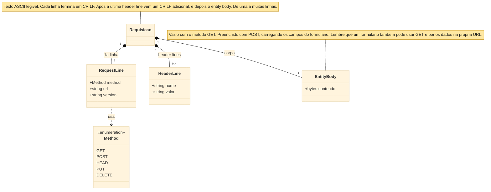

</Figure>

Os outros quatro métodos têm cada um a sua função. O **POST** carrega os campos de formulário no entity body — embora um formulário não seja
obrigado a usar POST; formulários HTML muitas vezes usam **GET** e anexam os dados à URL, como em
`www.somesite.com/animalsearch?monkeys&bananas`. O **HEAD** é como o GET, mas o servidor omite o objeto, o que o torna bem adequado à
depuração. O **PUT** faz upload de um objeto para um caminho, e o **DELETE** remove um.

Uma resposta também tem três seções: uma **status line** (versão, status code, status message), header lines e o entity body que carrega o
objeto. A resposta canônica do livro mostra os headers-chave:

```text
HTTP/1.1 200 OK
Connection: close
Date: Tue, 18 Aug 2015 15:44:04 GMT
Server: Apache/2.2.3 (CentOS)
Last-Modified: Tue, 18 Aug 2015 15:11:03 GMT
Content-Length: 6821
Content-Type: text/html

(data data data data data ...)
```

O `Date` é quando a **resposta** foi criada e enviada, não quando o objeto mudou pela última vez; o `Server` nomeia o software (análogo ao
`User-agent`); o `Last-Modified` é quando o **objeto** mudou pela última vez e é crítico para o caching; o `Content-Length` é o tamanho em
bytes; e o `Content-Type` dá o tipo do objeto — oficialmente por esse header, não pela extensão do arquivo.

<Figure caption="Figura 7 — Estrutura da mensagem de resposta: uma status line (versão, status code, frase) mais header lines mais o entity body, que carrega o objeto pedido." zoomable>

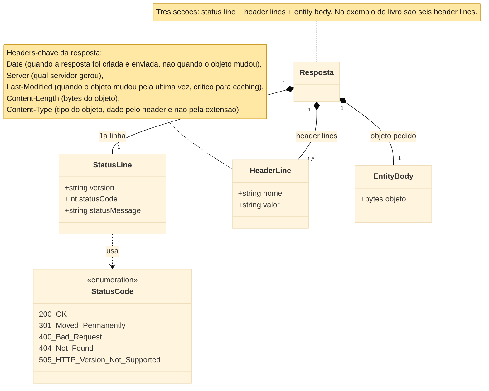

</Figure>

O status code e sua frase reportam o resultado. Os comuns são `200 OK` (sucesso, objeto devolvido), `301 Moved Permanently` (a nova URL está
no header `Location` e o cliente a busca automaticamente), `400 Bad Request` (um erro genérico que o servidor não conseguiu entender),
`404 Not Found` (documento inexistente) e `505 HTTP Version Not Supported`. O `200 OK` anterior do `example.com` já exibiu o caso de sucesso
ao vivo; os outros podem ser produzidos sob demanda. O método **HEAD** devolve só as linhas, sem objeto:

```text
curl.exe -I --http1.1 http://example.com/
```

```text
HTTP/1.1 200 OK
Date: Thu, 18 Jun 2026 02:36:55 GMT
Content-Type: text/html
Connection: keep-alive
Server: cloudflare
Last-Modified: Wed, 17 Jun 2026 20:54:39 GMT
Allow: GET, HEAD
Accept-Ranges: bytes
Age: 2044
cf-cache-status: HIT
CF-RAY: a0d6e8c03ad32039-IAD
```

A status line e os headers estão todos presentes, e o entity body está ausente — exatamente o que o livro descreve. Um **POST** carrega um
entity body que o GET não carrega. Enviando os próprios campos de formulário `monkeys` e `bananas` do livro:

```text
curl.exe -v -d "monkeys=1&bananas=2" http://httpbin.org/post
```

```text
> POST /post HTTP/1.1
> Host: httpbin.org
> User-Agent: curl/8.19.0
> Accept: */*
> Content-Length: 19
> Content-Type: application/x-www-form-urlencoded
>
< HTTP/1.1 200 OK
< Content-Type: application/json
< Server: gunicorn/19.9.0
<
{
  "form": {
    "bananas": "2",
    "monkeys": "1"
  }
}
```

A requisição anuncia `Content-Length: 19` e `Content-Type: application/x-www-form-urlencoded` e despacha os 19 bytes do corpo; o servidor de
teste ecoa o formulário interpretado de volta. O status code `301 Moved Permanently` igualmente surge de forma natural — é o que o próprio
servidor de exercícios interativos do livro, `gaia.cs.umass.edu`, devolve hoje em HTTP puro:

```text
curl.exe -v http://gaia.cs.umass.edu/kurose_ross/interactive/index.php
```

```text
> GET /kurose_ross/interactive/index.php HTTP/1.1
> Host: gaia.cs.umass.edu
< HTTP/1.1 301 Moved Permanently
< Server: Apache/2.4.62 (AlmaLinux) OpenSSL/3.5.5 mod_fcgid/2.3.9 mod_perl/2.0.12 Perl/v5.32.1
< Location: https://gaia.cs.umass.edu//kurose_ross/interactive/index.php
< Content-Type: text/html; charset=iso-8859-1
```

O header `Location` carrega a nova URL — aqui a versão HTTPS do mesmo path — que o cliente segue automaticamente. E o `404 Not Found`
decorre de uma única requisição por um objeto que não existe:

```text
curl.exe -sI http://example.com/this-does-not-exist
```

```text
HTTP/1.1 404 Not Found
Date: Thu, 18 Jun 2026 02:36:59 GMT
Content-Type: text/html
Connection: keep-alive
Server: cloudflare
```

Como as mensagens são ASCII, o livro recomenda um exercício prático: abrir uma conexão TCP crua e digitar uma requisição à mão.

<Figure caption="Figura 8 — O exercício de conversa crua do livro: abra uma conexão TCP crua na porta 80, digite um GET à mão e leia de volta a status line, os headers e o HTML; hoje o mesmo host responde 301 e a conversa migra para TLS na porta 443." zoomable>

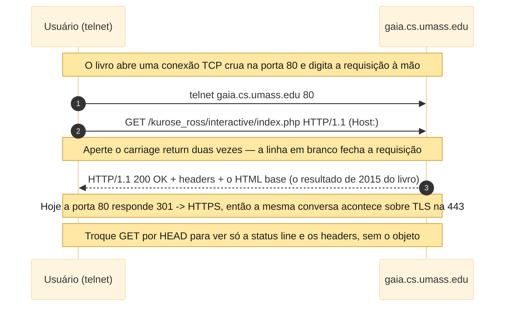

</Figure>

<Warning>
  A instrução do livro é `telnet gaia.cs.umass.edu 80`, seguida de um `GET` de uma linha e o `Host`, com a tecla Enter pressionada duas
  vezes. No Windows, o Telnet Client agora vem desabilitado, e o host responde `301 Moved Permanently` na porta 80 de qualquer forma, então
  o equivalente moderno é o `curl -v` acima: ele torna a mesma conversa crua observável, e o `301` que ele devolve é justamente o redirect
  para HTTPS que empurrou o exercício para o TLS e a porta 443. A substituição de `GET` por `HEAD` (o `-I` do curl) produz apenas as linhas.
</Warning>

Quais header lines um navegador inclui depende do seu tipo e versão, da configuração do usuário (como a língua preferida) e de ele ter ou
não uma cópia em cache do objeto; os servidores variam por produto, versão e configuração da mesma forma. Apenas uma pequena fração dos
headers que a especificação define foi coberta aqui — e mais alguns aparecem na discussão sobre caching.

## Cookies: quatro componentes e um ciclo Set-Cookie real

O caráter stateless simplifica o servidor, mas um site muitas vezes **precisa identificar** um usuário — para restringir o acesso ou para
servir conteúdo conforme a identidade. Uma loja online, por exemplo, precisa lembrar o carrinho de um usuário ao longo de dezenas de
páginas, ainda que cada requisição chegue de forma independente. O HTTP reconcilia os dois com os **cookies**, definidos no **RFC 6265**
[@RFC6265], e a maioria dos grandes sites comerciais os usa.

A tecnologia de cookies tem **quatro componentes**: (1) um header `Set-cookie` na **resposta**; (2) um header `Cookie` na **requisição**;
(3) um **cookie file** na máquina do usuário, gerido pelo navegador; e (4) um **banco de dados back-end** no site. Dois dos quatro são
simplesmente mais headers HTTP; os outros dois são a memória guardada em cada ponta.

O percurso do livro procede da seguinte forma. Susan, que sempre usa o Internet Explorer no PC de casa, contata a Amazon pela primeira vez
(ela já havia visitado o eBay). A Amazon cria um número de identificação único e uma entrada no banco indexada por ele, e responde com
`Set-cookie: 1678`. O navegador dela anexa uma linha — o hostname do servidor e o número — ao seu cookie file, que já tinha uma entrada do
eBay. Daí em diante, cada requisição à Amazon carrega `Cookie: 1678`, de modo que a Amazon consegue rastrear quais páginas o usuário 1678
visitou, em que ordem e em que horários. Isso viabiliza o carrinho de compras e as recomendações, e se Susan se registra (nome, e-mail,
endereço, cartão) o banco amarra o nome dela ao número 1678 — a base do one-click shopping. O protocolo permanece stateless por baixo; o
"estado" vive no crachá que vai e volta.

<Figure caption="Figura 9 — Mantendo estado com cookies: o Set-cookie na resposta vira uma linha no cookie file, e o header Cookie reaparece em cada requisição seguinte, exercitando os quatro componentes." zoomable>

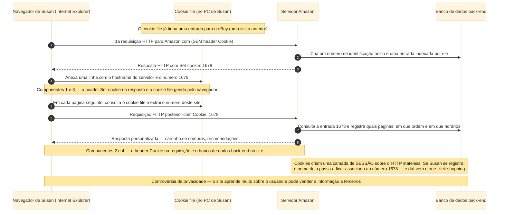

</Figure>

O ciclo inteiro é reproduzível com o curl. Primeiro o servidor envia o `Set-Cookie`, e o `-c` grava o cookie file do curl:

```text
curl.exe -v -c jar.txt "http://httpbin.org/cookies/set?sessionid=1678"
```

```text
> GET /cookies/set?sessionid=1678 HTTP/1.1
> Host: httpbin.org
< HTTP/1.1 302 FOUND
< Server: gunicorn/19.9.0
< Location: /cookies
* Added cookie sessionid="1678" for domain httpbin.org, path /, expire 0
< Set-Cookie: sessionid=1678; Path=/
```

O servidor de teste usa o nomeado `sessionid=1678` onde o livro escreveu o cru `1678`, mas o padrão é exatamente o de Susan. O cookie file
que o curl gravou é o componente "cookie file" do livro, no formato Netscape, carregando o **hostname** e o **identificador**:

```text
# Netscape HTTP Cookie File
# https://curl.se/docs/http-cookies.html
# This file was generated by libcurl! Edit at your own risk.

httpbin.org	FALSE	/	FALSE	0	sessionid	1678
```

Na requisição seguinte, o `-b` relê esse arquivo, então o cliente coloca o header `Cookie` no fio e o servidor reconhece o identificador:

```text
curl.exe -v -b jar.txt http://httpbin.org/cookies
```

```text
> GET /cookies HTTP/1.1
> Host: httpbin.org
> Cookie: sessionid=1678
< HTTP/1.1 200 OK
<
{
  "cookies": {
    "sessionid": "1678"
  }
}
```

É a Figura 9 em miniatura: `Set-Cookie` na resposta, uma linha no cookie file, `Cookie` na requisição seguinte, o servidor reconhecendo o
cliente. O `302`, o formato de jar Netscape e as flags `-c`/`-b` são a maquinaria concreta do curl, não o texto do livro, mas mapeiam de
forma limpa nos seus quatro componentes. Os cookies criam, assim, uma camada de sessão de usuário sobre o HTTP stateless — o mesmo mecanismo
por trás de manter-se logado numa conta de webmail. Eles também são controversos: combinados com informações de conta, um site pode aprender
muito sobre um usuário e potencialmente vendê-lo a terceiros.

## Web caching, o exemplo numérico, CDNs e o conditional GET

Considere-se uma universidade inteira navegando por um único enlace compartilhado para a Internet. Se cada requisição tiver de atravessar
esse enlace de acesso estreito até um origin server do outro lado do mundo, o enlace torna-se o gargalo de todos. O remédio espelha o de uma
biblioteca de bairro que mantém os livros mais procurados à mão: posicionar uma cópia do que já foi buscado perto de quem o solicita.

<Definition title="Web cache (proxy server)">
  Uma entidade de rede que atende requisições HTTP em nome de um origin server. Ele tem armazenamento em disco próprio, guarda cópias dos
  objetos requisitados recentemente e é configurado para que todas as requisições do navegador sejam direcionadas a ele primeiro.
</Definition>

O fluxo para `http://www.someschool.edu/campus.gif` é curto. O navegador abre uma conexão TCP ao cache e solicita o objeto. No **hit**, o
cache devolve a sua cópia local. No **miss**, o cache abre uma conexão TCP ao **origin server**, busca o objeto, **guarda uma cópia** e o
devolve ao navegador pela conexão que já está aberta. A observação-chave é que um cache é **ao mesmo tempo servidor e cliente**: servidor
para o navegador, cliente para o origin.

<Figure caption="Figura 10 — Um Web cache (proxy): no hit ele devolve a cópia local, enquanto no miss ele abre uma conexão TCP ao origin, busca, guarda e devolve — agindo como servidor e cliente ao mesmo tempo." zoomable>

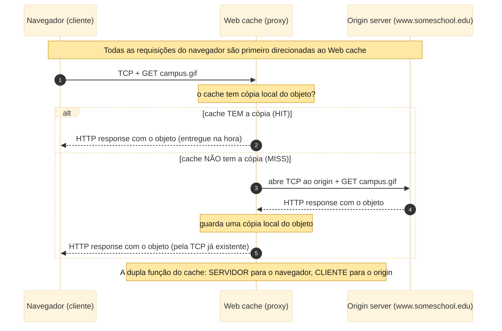

</Figure>

Um cache costuma ser comprado e instalado por um **ISP** (Internet Service Provider) — uma universidade no campus, ou um ISP residencial
como a Comcast na sua rede — por dois motivos: ele **reduz o tempo de resposta** (o enlace até o cache é rápido e local) e **reduz o tráfego
no enlace de acesso** à Internet, adiando upgrades caros e aliviando o congestionamento para todos.

Os números do livro fecham o argumento. Tome uma **LAN** (Local Area Network) institucional a 100 Mbps ligada à Internet por um enlace de
acesso de **15 Mbps**; tamanho médio de objeto **1 Mbit**; **15 requisições por segundo**; e um "Internet delay" de ida e volta de **2
segundos** para buscar nos origin servers. A intensidade de tráfego é `taxa de requisições × tamanho do objeto ÷ taxa do enlace`. Na LAN
isso é `(15)(1)/100 = 0.15`, que adiciona no máximo dezenas de milissegundos — desprezível. No enlace de acesso é `(15)(1)/15 = 1.0`, e
quando a intensidade se aproxima de 1 o atraso cresce sem limite, empurrando o tempo médio de resposta para a **ordem de minutos** —
inaceitável.

Há duas saídas. A **Solução 1** é fazer upgrade do enlace de acesso de 15 para 100 Mbps, o que derruba a sua intensidade para 0.15 e o tempo
total para cerca de 2 segundos — mas o upgrade é **caro**. A **Solução 2** é instalar um Web cache e deixar o enlace em paz. As hit rates na
prática ficam entre **0.2 e 0.7**; suponha **0.4**. Então 40% das requisições são atendidas pelo cache local em cerca de 10 ms, e só os 60%
restantes cruzam o enlace de acesso, o que derruba a sua intensidade de 1.0 para **0.6** e o seu atraso de volta à faixa desprezível. O
atraso médio fica:

```text
0.4 × (0.01 s) + 0.6 × (2.01 s) = 1.21 s
```

pouco mais de **1.2 segundos** — melhor ainda que o upgrade caro, e sem tocar no enlace. O cache em si é barato, já que boa parte do
software de cache é de domínio público e roda em PCs baratos.

<Figure caption="Figura 11 — O gargalo no enlace de acesso: sem cache a intensidade no acesso é 1.0 e o atraso vira minutos, enquanto um cache com hit rate 0.4 derruba a intensidade para 0.6 e o atraso médio para cerca de 1.2 s, sem upgrade do enlace." zoomable>

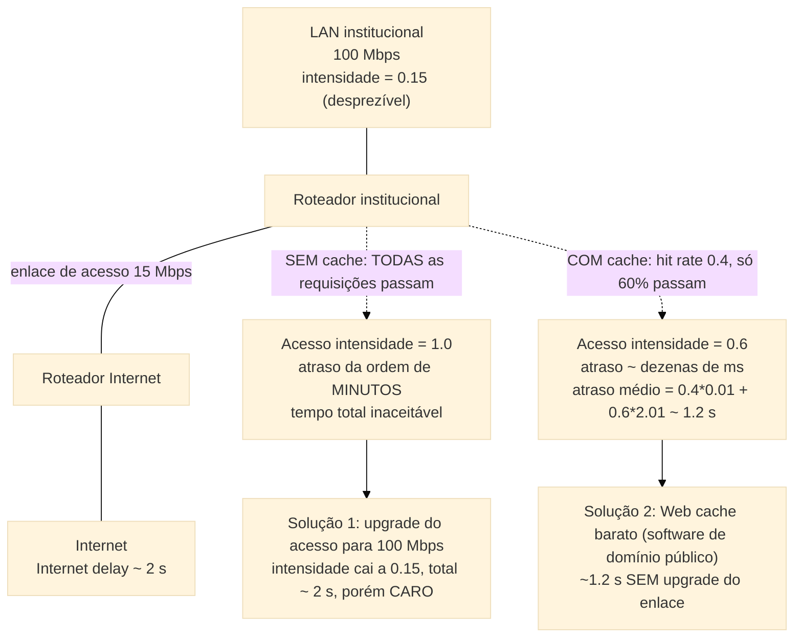

</Figure>

Em escala, essa ideia torna-se uma **CDN** (Content Distribution Network): uma empresa instala muitos caches geograficamente distribuídos
pela Internet, localizando boa parte do tráfego. Há CDNs **compartilhadas** (Akamai, Limelight) e **dedicadas** (Google, Netflix). O cache
deixa de ser uma caixa isolada num campus e torna-se uma rede planetária de cópias.

O caching introduz um problema novo: uma cópia cacheada pode estar **stale** (desatualizada) — o objeto no origin server pode ter mudado
desde que foi cacheado. O HTTP resolve isso com o **conditional GET**.

<Definition title="Conditional GET">
  Uma requisição HTTP que usa o método `GET` e inclui um header `If-Modified-Since`. Ela diz ao servidor para mandar o objeto apenas se ele
  tiver mudado desde a data informada.
</Definition>

O mecanismo se apoia no header `Last-Modified` da seção das mensagens. Quando o cache busca `/fruit/kiwi.gif` pela primeira vez, ele guarda
o objeto **e** a sua data de `Last-Modified` (digamos `Wed, 9 Sep 2015 09:23:24`). Uma semana depois, ao pedirem o mesmo objeto, o cache faz
uma verificação de atualidade emitindo um conditional GET cujo valor de `If-modified-since` é **exatamente** aquela data de `Last-Modified`.
Se o objeto não mudou, o servidor responde `304 Not Modified` com um **corpo vazio**, e o cache entrega a sua própria cópia — nenhum objeto
trafega duas vezes.

<Figure caption="Figura 12 — O conditional GET: o cache guarda o objeto junto com a sua data de Last-Modified e, uma semana depois, manda If-Modified-Since; se nada mudou, o servidor devolve 304 Not Modified sem corpo, poupando banda." zoomable>

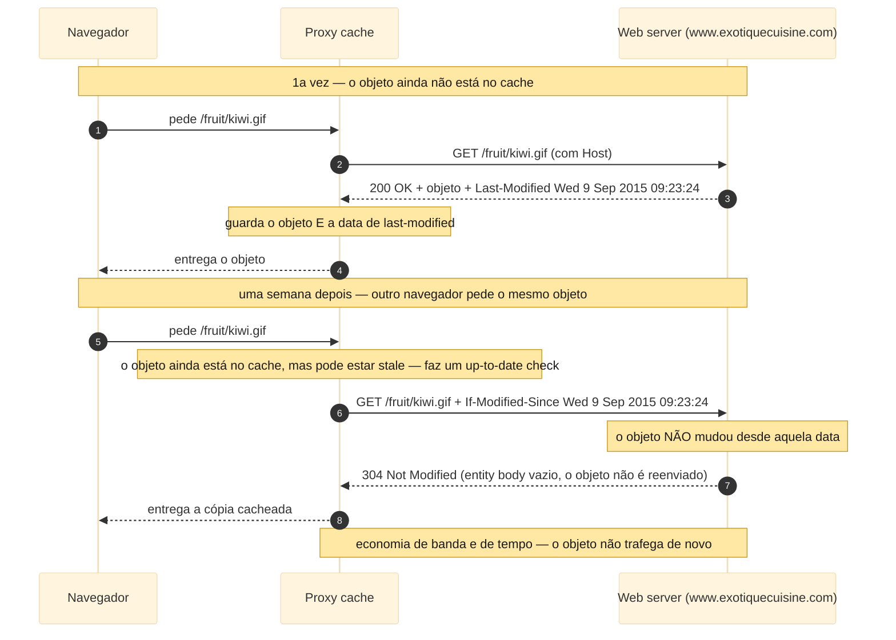

</Figure>

O padrão se reproduz exatamente. Primeiro o `Last-Modified` de um objeto é capturado com um HEAD, depois reenviado como `If-Modified-Since`:

```text
curl.exe -sI http://example.com/
```

```text
HTTP/1.1 200 OK
Server: cloudflare
Last-Modified: Wed, 17 Jun 2026 20:54:39 GMT
```

```text
curl.exe -v -H "If-Modified-Since: Wed, 17 Jun 2026 20:54:39 GMT" http://example.com/
```

```text
> GET / HTTP/1.1
> Host: example.com
> If-Modified-Since: Wed, 17 Jun 2026 20:54:39 GMT
>
< HTTP/1.1 304 Not Modified
< Server: cloudflare
< Last-Modified: Wed, 17 Jun 2026 20:54:39 GMT
< etag: "6a33098f-22f"
```

O valor de `If-Modified-Since` é igual ao `Last-Modified` de um instante antes, e o servidor responde `304 Not Modified` sem corpo —
precisamente a troca do livro. Funciona também contra um servidor Apache real. O `info.cern.ch`, lar do primeiro site da Web, serve o mesmo
arquivo com um `Last-Modified` estável desde 2014:

```text
curl.exe -sI http://info.cern.ch/
```

```text
HTTP/1.1 200 OK
Server: Apache
Last-Modified: Wed, 05 Feb 2014 16:00:31 GMT
ETag: "286-4f1aadb3105c0"
Content-Length: 646
```

```text
curl.exe -v -H "If-Modified-Since: Wed, 05 Feb 2014 16:00:31 GMT" http://info.cern.ch/
```

```text
> GET / HTTP/1.1
> Host: info.cern.ch
> If-Modified-Since: Wed, 05 Feb 2014 16:00:31 GMT
>
< HTTP/1.1 304 Not Modified
< Server: Apache
< Last-Modified: Wed, 05 Feb 2014 16:00:31 GMT
< ETag: "286-4f1aadb3105c0"
```

O servidor Apache devolve o mesmo `304 Not Modified` por data, fiel ao exemplo do K&R até a linha `Server: Apache`.

<Warning>
  Note-se o header `ETag` acima. Uma segunda forma de requisição condicional, `If-None-Match`, valida contra essa tag opaca em vez de uma
  data e também resulta em `304`. É uma extensão útil do mundo real — mas **não** faz parte do mecanismo da seção 2.2.5 do K&R, que usa só
  `If-Modified-Since` contra `Last-Modified`. O par `ETag`/`If-None-Match` pertence ao HTTP moderno, não ao conditional GET do livro.
</Warning>

## HTTP hoje: HTTPS, a revisão RFC de 2022 e o HTTP/2 e /3

O livro é fiel ao HTTP da sua época, e convém fechar a distância até os padrões como se encontram hoje — tudo verificável contra o registro
dos RFCs. O livro afirma que o HTTP "está definido na RFC 1945 e na RFC 2616". Isso é historicamente exato: o **RFC 1945** [@RFC1945] é o
HTTP/1.0 (1996), e o **RFC 2616** [@RFC2616] é o HTTP/1.1 clássico de documento único (1999). Seguem-se duas ressalvas. O RFC 1945 é apenas
um documento **Informational**, não um padrão da trilha de padronização; e o RFC 2616 está agora **obsoleto** — foi substituído em 2014 e
então, em 2022, trocado por um novo núcleo.

<Note>
  A revisão de 2022 separa o HTTP em semântica independente de versão e mensagens por versão. O **RFC 9110, HTTP Semantics** [@RFC9110], um
  Internet Standard (STD 97), define os métodos, status codes, header fields, a negociação de conteúdo e as requisições condicionais
  compartilhados por toda versão. O **RFC 9112, HTTP/1.1** [@RFC9112], um Internet Standard (STD 99), define a sintaxe das mensagens
  HTTP/1.1 e o gerenciamento de conexão. Então o HTTP/1.1 atual é o RFC 9112 mais o RFC 9110, não o RFC 2616.
</Note>

As versões superiores seguem a mesma separação. O **HTTP/2**, que o livro apresenta como RFC 7540 [@RFC7540] — intercalando e priorizando
mensagens numa só conexão —, é agora definido pelo **RFC 9113** [@RFC9113], que obsoleta o RFC 7540 e reaproveita a semântica do RFC 9110. O
**HTTP/3** é o **RFC 9114** [@RFC9114]: a mesma semântica HTTP carregada sobre o transporte QUIC em vez do TCP, com TLS 1.3 embutido. Os
cookies são a única peça que não precisa de ressalva — o **RFC 6265** [@RFC6265] é atual.

<Warning>
  Os níveis de maturidade devem ser declarados com precisão: só o **RFC 9110** (STD 97) e o **RFC 9112** (STD 99) são Internet Standards
  plenos. O **RFC 9113** (HTTP/2) e o **RFC 9114** (HTTP/3) são Proposed Standards; o **RFC 1945** é Informational; o **RFC 6265** é um
  Proposed Standard; e o **RFC 2616** era um Draft Standard e está obsoleto. O RFC 2616 e o RFC 7540 devem ser citados como aquilo que o
  livro referencia, mas nunca como as especificações atuais.
</Warning>

Isso também explica uma pequena surpresa do laboratório. O exercício de conversa crua do livro mirava o HTTP puro na porta 80, mas o
`gaia.cs.umass.edu` respondeu `301 Moved Permanently` com um `Location` apontando para `https://...`. A porta 80 em texto puro é hoje, para
a maioria dos sites, pouco mais que um redirect para o **HTTPS**, a mesma semântica HTTP carregada dentro de um túnel **TLS** (Transport
Layer Security). O protocolo descrito acima não mudou; hoje ele costuma viajar embrulhado.

## Próximos passos

Com isto encerra-se o exame do HTTP, o primeiro protocolo de camada de aplicação estudado em detalhe. O formato das mensagens HTTP e as
ações que um cliente e um servidor tomam para trocá-las foram apresentados, além de uma fatia da infraestrutura de aplicação da Web —
caches, cookies e bancos de dados back-end — tudo amarrado de volta ao protocolo. O laboratório parou onde a conversa do curl já expõe tudo
o que o fio carrega.

Várias extensões permanecem. O livro deixa a comparação **quantitativa** entre conexões não-persistentes e persistentes para os exercícios
dos Capítulos 2 e 3, e aprofunda as **CDNs** na Seção 2.6. No lado prático, uma extensão natural é a inspeção em nível de pacote com o
**Wireshark** contra um alvo em texto puro — o `info.cern.ch` ainda serve na porta 80 —, filtrando por `http` para observar a request line,
os headers e o three-way handshake no fio, com o `Follow HTTP Stream` expondo a requisição e a resposta lado a lado. A partir daí, a captura
de uma sessão **HTTP/2** ou **HTTP/3** real é a ponte para a pilha moderna que a seção anterior delineou.

## Referências
